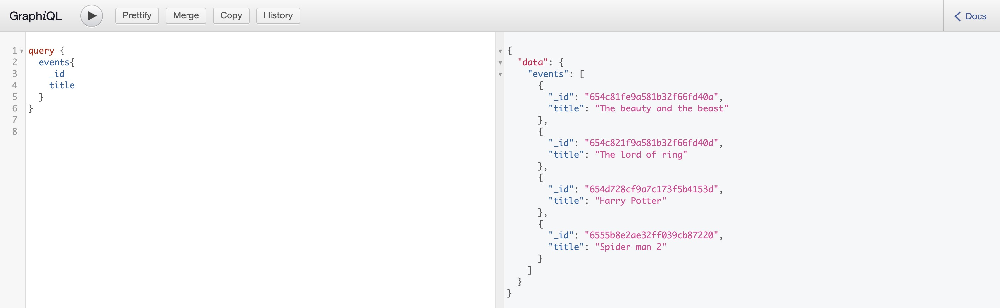
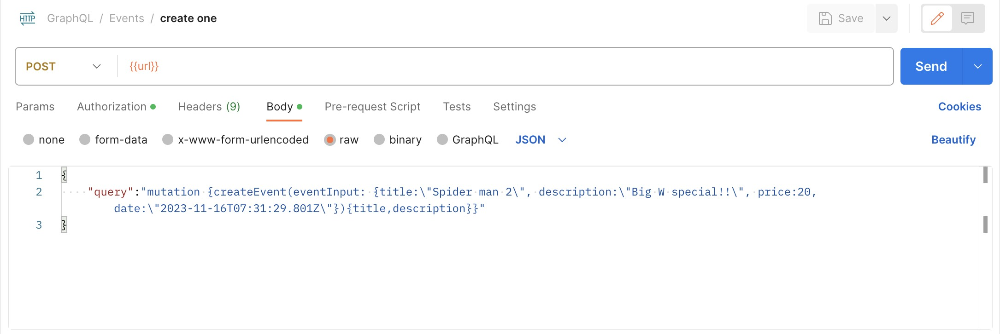
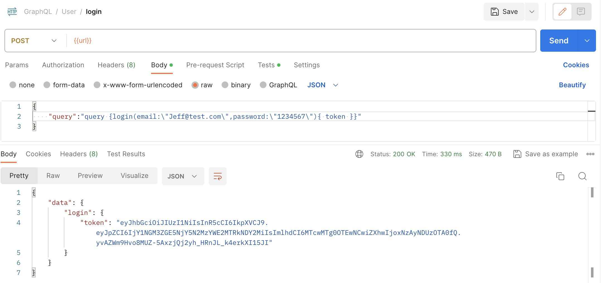

# 测试

测试 GraphQL 运行情况。

## 通过 localhost

`localhost:端口/graphql` 打开之后界面如下



## 通过 postman

语法有点不同，是在 body 中传入 query 或者 mutation 字符串。




## 通过代码

其实只需要更换 request body 就可以了。

也就是说可以将其余部分包裹成一个函数，只要传入 request 就可以了。而 request 也可以多次包裹。

```js title="dataFetcher.js"
const sendRequest = async (requestBody) => {
  try {
    const res = await fetch(URL_API, {
      method: "POST",
      headers: {
        "Content-Type": "application/json",
      },
      // highlight-next-line
      body: JSON.stringify(requestBody),
    });
    if (!res) throw new Error("There is an error when connecting server");
    const data = await res.json();
    if (data.errors?.length > 0) throw new Error(data.errors[0].message);

    return data;
  } catch (error) {
    return { error };
  }
};

export const login = async (email, password) => {
  const requestBody = {
    // correct-start
    query: `
      query {
        login(email: "${email}", password: "${password}"){
          token
        }
      }
    `,
    // correct-end
  };
  const res = await sendRequest(requestBody);
  return res;
};

export const signUp = async (email, password) => {
  const requestBody = {
    // correct-start
    query: `
      mutation {
        createUser(userInput: {email: "${email}", password: "${password}"}){
          _id
          email
        }
      }
    `,
    // correct-end
  };
  const res = await sendRequest(requestBody);
  return res;
};
```
