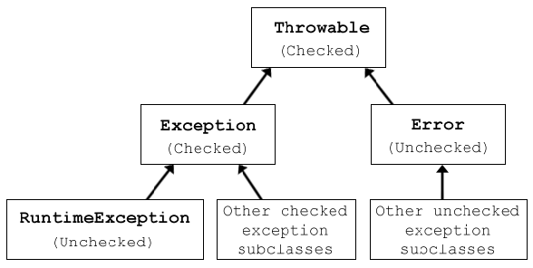

# 异常处理与 Try catch

在 Java 中，所有的错误都可以分为三种基本类型：

**错误 Errors**：代表程序无法处理的问题（例如，严重的硬件故障）。

**运行时异常 RuntimeExceptions**：代表程序可能想要处理的问题，但不是强制性的（例如，除零错误 - 在给定的问题中是否可能发生这个问题决定了是否应该明确处理）。

**异常 Exceptions**：代表程序应该处理的问题，代码必须明确处理可能性的一种方式（例如，尝试访问一个不存在的文件）。

在 Java 中，通过 throw 关键字生成错误，并附带适当类型的对象。

```java
throw new IOException();
```

:::tip
可以提供给 throw 语句的对象类型都是 Throwable 类的子类。


:::

利用继承系统，我们可以创建具有特定于所建模问题的信息的适当类型的错误。

## 错误处理

当某个代码段生成错误时，有两种基本机制来处理它，即错误可以传递到其他地方进行处理，或者被`catch`并处理。

对于已检查的异常，必须以这两种方式之一处理。未经检查的异常（RuntimeException 的子类）和错误不需要处理（但如果需要，也可以处理，尽管通常错误严重到程序无法处理）。

如果当前方法不是正确处理错误的地方，可以在方法签名中添加 throws 声明，列出方法可能生成但不会处理的错误。然后将错误传递给调用当前方法的方法，并且可以在那里做出处理或传递的决定。

此时方法就会像这样：

```java
<access modifier> [optional keywords] <return type> <name>(<parameter list>) throws <list of error types> {
    <code>
}
```

例如：

```java
public static String fileToString() throws IOException, FileNotFoundException { ... }
```

### try catch

老朋友了！在 Java 中也用。

如果当前方法是正确处理错误的地方，则可能生成错误的代码需要放在 try-catch 块中。如果发生错误，代码将在那一点停止，并尝试找到与错误类型匹配的第一个 catch。该结构类似于 else-if 块，但用于处理错误。

```java
try {
 ...
 //code that might throw some type of error
 ...
}
catch (<error type> <variable name>) {
 <code for what to do when the error occurs>
}
catch (<error type> <variable name>) {
 <code what to do when this other error occurs>
}
...
```

一个 try-catch 块可以有**多个 catch 块**，对应 try 部分代码可能抛出的错误类型，它们按顺序进行匹配，将抛出的错误与 catch 子句中声明的错误类型进行比较。

如果错误不是 catch 子句中命名的任何一种，则将其传递给下一个处理程序。

如果有任何已检查的异常未处理，或者处理了代码无法抛出的任何错误，编译器将生成编译时错误。

以下代码生成并捕获异常：

```java
public class ExceptionThrower {

    public static void exceptionGenerator() throws Exception {
        throw new Exception("This came from the exceptionGenerator() method.");
    }

    public static void main(String[] args) {

        try {
            System.out.println("Just before the exception is thrown.");
            exceptionGenerator();
            System.out.println("This line will not be reached.");
        }
        catch (Exception e) {
            System.out.println("Made it to the catch block with.");
            System.out.println("The error has a message: " + e.getMessage());
        }

        System.out.println("The method can continue after the try-catch.");
    }
}
```

### finally

try-catch 结构还可以附加一个 finally 子句。这是一段代码，即使 try 块失败，也会被执行。

虽然有一些方式可以导致级联错误阻止 finally 块的运行，但它具有一定程度的保证，即 finally 中的代码将始终被执行，因此它是一个有用的工具，可以优雅地完成任务（包括失败）。

```java
public class FinallyExample {
    public static void main(String[] args) throws Exception {

        try {
            System.out.println("We'll throw an exception on the next line, but we won't catch it.");
            throw new Exception();
            //System.out.println("We can't get to this line."); //<= unreachable
        }
        finally {
            System.out.println("This will still run anyway.");
        }

        //System.out.println("Because the exception wasn't caught, we can't continue after the try-catch."); //<= unreachable
    }
 }
```
