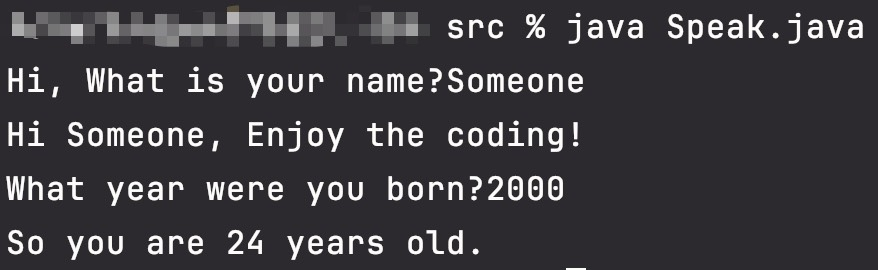
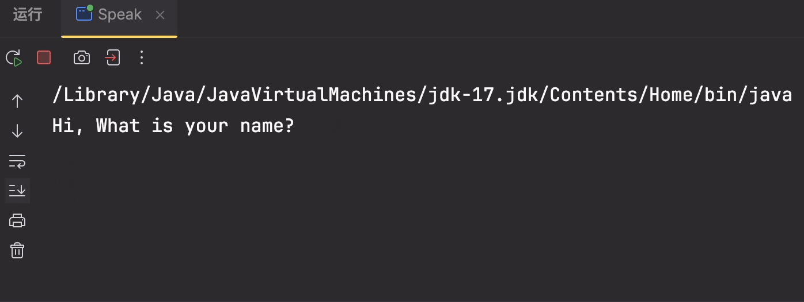

# 输入与输出

Input 与 Output 在代码中很重要。

## Input

### Console

System.console 不可以直接运行，需要在终端手动运行(类似 node 的运行方式)

`readLine()` 可以读取 console 中输入的字段。

```JAVA title="Syntax"
System.console().readLine()
```

```java title="example"
public static String getInputFromConsole(int currentYear) {
  String name = System.console().readLine("Hi, What is your name?");
  System.out.println("Hi " + name + ", Enjoy the coding!");
  String dateOfBirth = System.console().readLine("What year were you born?");
  int age = currentYear - Integer.parseInt(dateOfBirth);
  return "So you are " + age + " years old.";
}
```



### Scanner

scanner 一般与 System.in 配合使用，System.in 在 Scanner 初始化对象时，作为参数传递进去，这说明，类 Scanner 可以使用输入流 System.in

```java
// 首先Scanner的实例
Scanner scanner = new Scanner(System.in);
// 操作实例，读取一行字符串：
String aLine = scanner.nextLine();
// 操作实例，读取一个单词：
String aWord = scanner.next();
// 操作实例，读取一个整数：
int anInteger = scanner.nextInt();
// 操作实例，读取一个浮点数：
double aDouble = scanner.nextDouble();
```

我们来看一个类似的使用例子：

```java
public static String getInputFromScanner(int currentYear) {
  Scanner scanner = new Scanner(System.in);

  System.out.println("Hi, What is your name?");
  String name = scanner.nextLine();
  System.out.println("Hi " + name + ", Enjoy the coding!");

  System.out.println("What year were you born?");
  boolean validDOB = false;
  int age = 0;
  do {
      System.out.println("(Please enter a valid year between " + (currentYear - 125) + " and " + (currentYear) + " )");
      try {
          age = checkData(currentYear, scanner.nextLine());
          validDOB = age >= 0;
      } catch (NumberFormatException badUserData) {
          System.out.println("Characters not allowed! Please try again.");
      }

  } while (!validDOB);

  return "So you are " + age + " years old.";
}
```



## Output

Java 中的打印与 JS 语法不同：

```java
System.out.println();
```

打印结果不需要多说，经常使用。
