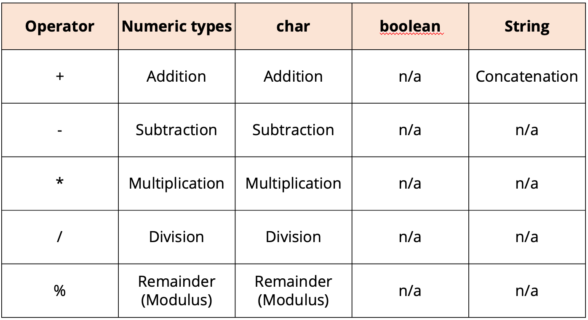
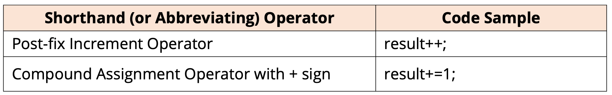
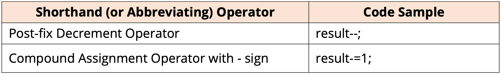
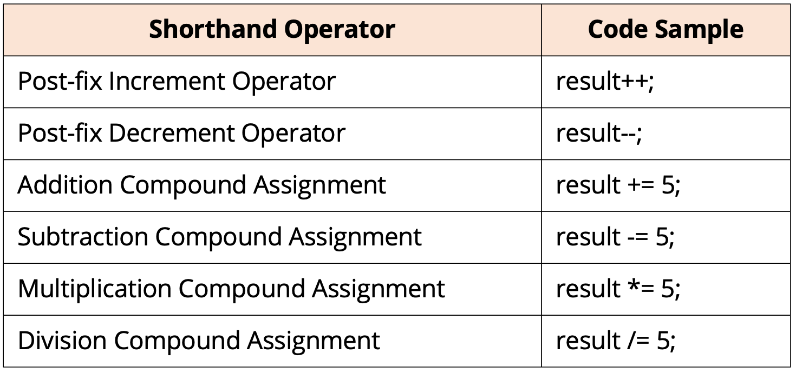
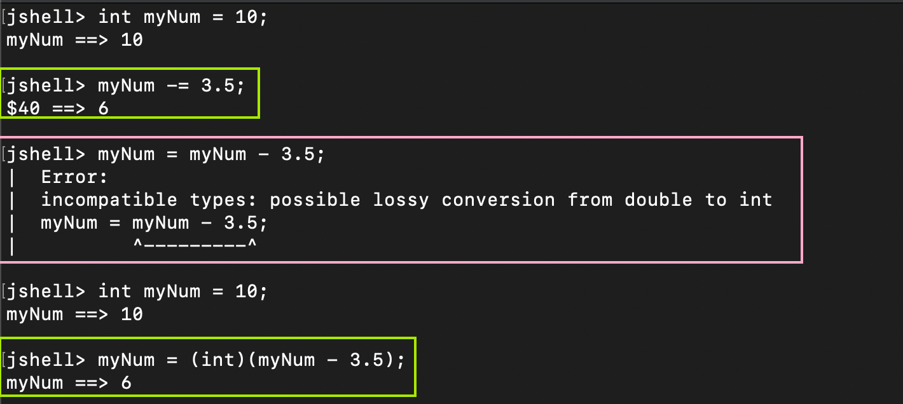

# 运算符

代码无法脱离运算符，大部分 JAVA 的运算符与 JS 是类似的，少部分有微妙区别但是逻辑类似。

## 相似部分

### 计算符号 +-\*/

:::note
大部分计算与 JS 无异，有个需要注意的点是`JAVA中的char可以用来计算`
:::



#### 计算符号简写

简写方式与 JS 区别也不大。




:::warning
有一点要注意的是，在 `-=` 中，其实 JAVA 做了 `Casting`
一个例子了解一下：


所以实际上 `X -= Y` 和 `(int) ( X - Y)` 是类似的
:::

## 不同部分

### Equality 运算符 (==)

**在 JAVA 中，==号是等于运算**，而不是 JS 中的===。

```java
public class Hello {
    public static void main(String[] args) {
        int testNum = 12;

        System.out.println(testNum == 13);   //false
    }
}
```
