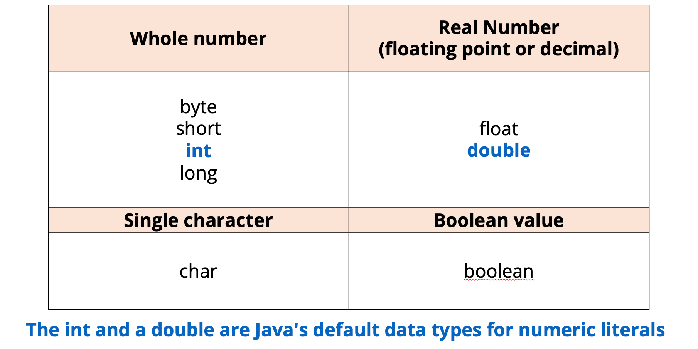
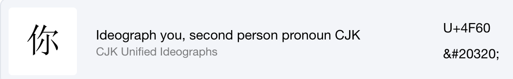

# 基本数据类型

Java 语言提供了八种基本类型。六种数字类型（四个整数型，两个浮点型），一种字符类型，还有一种布尔型。



:::note
JAVA 中常用的数字类型是 int，Double。
:::

## 整数类型

### byte

- byte 数据类型是 8 位、有符号的，以二进制补码表示的整数；
- 最小值是  -128（-2^7）；
- 最大值是  127（2^7-1）；
- 默认值是  0；
- byte 类型用在大型数组中节约空间，主要代替整数，因为 byte 变量占用的空间只有 int 类型的四分之一；
- 例子：byte a = 100，byte b = -50。

### short

- short 数据类型是 16 位、有符号的以二进制补码表示的整数
- 最小值是  -32768（-2^15）；
- 最大值是  32767（2^15 - 1）；
- Short 数据类型也可以像 byte 那样节省空间。一个 short 变量是 int 型变量所占空间的二分之一；
- 默认值是  0；
- 例子：short s = 1000，short r = -20000。

### int

- int 数据类型是 32 位、有符号的以二进制补码表示的整数;
- 最小值是  -2,147,483,648(-2^31);
- 最大值是  2,147,483,647 (2^31 - 1);
- 如果尝试给最小值减少，或者给最大值增加，最终会导致溢出：`Overflow/Underflow`（最小值减少变成最大值，循环）
- **一般地整型变量默认为 int 类型;**
- 默认值是  0 ;
- 例子：int a = 100000, int b = -200000.
- 增加数字可读性：

```java
int myBigNum = 2_147_483_647;
//output: myBigNum ==> 2147483647
```

### long

- long 数据类型是 64 位、有符号的以二进制补码表示的整数；必须以 L 结尾。
- 最小值是  -9,223,372,036,854,775,808（-2^63）；
- 最大值是  9,223,372,036,854,775,807（2^63 -1）；
- **这种类型主要使用在需要比较大整数的系统上；**
- 默认值是  0L；
- 例子： long a = 100000L，long b = -200000L。"L"理论上不分大小写，但是若写成"l"容易与数字"1"混淆，不容易分辩。所以最好大写。加了之后才会被视为 long。

```java
long myReallyBigNum = 20000000000L;
//output: myReallyBigNum ==> 20000000000
```

## 小数类型

当我们需要精确计算的时候，就需要 floating 和 double

### float

- float 数据类型是单精度、32 位、符合 IEEE 754 标准的浮点数；
- float 在储存大型浮点数组的时候可节省内存空间；
- 默认值是  0.0f；
- 浮点数不能用来表示精确的值，如货币；
- 例子：float f1 = 234.5f。

### double

- **现代计算机更推荐直接使用 double，运算速度更快，精度更高，范围更大。**
- double 数据类型是双精度、64 位、符合 IEEE 754 标准的浮点数；
- 浮点数的默认类型为 double 类型；
- double 类型同样不能表示精确的值，如货币；
- 默认值是  0.0d；

:::warning
Double 类型的计算有一些需要注意的地方：

```JAVA title="double 计算"
int num1 = 5 / 2;
// num1 ==> 2
double num2 = 5 / 2;
//num2  ==> 2.0
// correct-start
double num3 = 5 / 2d;
//num3 ==> 2.5
// correct-end
```

而且**千万不要写错后缀**

```JAVA title="double 计算"
float num4 = 5f / 3;
// num4 ==> 1.6666666
double num5 = 5d / 3;
// num5 ==> 1.6666666666666667

// error-start
double num6 = 5f / 3;
// num6 ==> 1.6666666269302368
// error-end
```

:::

## 字符类型

### char

- char 类型是一个单一的 16 位 Unicode 字符；
- char 在计算机中的存储为数字
- 最小值是  \u0000（十进制等效值为 0）；
- 最大值是  \uffff（即为 65535）；
- char 数据类型可以储存任何字符；
- 例子：char letter = 'A';。

#### char 与 String 区别

Char 与 string 不同，char 只可以保存一个字符，并且必须使用单引号。
而 String 可以保存多个字符，使用双引号。

```java title="Char"
// error-start
char myChar = "A";
char myChar = 'ABCD';
// error-end
// 必须是单引号，且只可以一个字符
// correct next line
char myChar = 'A'
```

```java title="String"
// error-start
// correct next line
String myStr = "ABCD"
```

Char 只能存一个字符有什么用？例子：可以用来存储游戏中用户按下的最后一个键，或者遍历字母表中的一个字母。

#### char 编码

每个 char 都有编码，创建 char 的时候也可以根据编码来创建：
[char 编码网址](https://symbl.cc/en/)



```java title="Char 编码"
char niChar = '\u4F60';
char niChar2 = 20320;

// 结果输出都为 '你'
```

```JAVA title="Char part 2"
char firstChar = 65;
char secondChar = 66;
// firstChar = 'A'; secondChar = 'B'

System.out.print( firstChar + secondChar )
// result: 131
```

## 布尔类型

### boolean

- boolean 数据类型表示一位的信息；
- 只有两个取值：true 和 false；
- 这种类型只作为一种标志来记录 true/false 情况；
- 默认值是  false；
- 例子：boolean one = true。

:::note
与 JS 差别不大
:::

```JAVA title="Boolean"
int childAge = 8;

boolean isAdult = childAge > 18;

// isAdult: false
```
