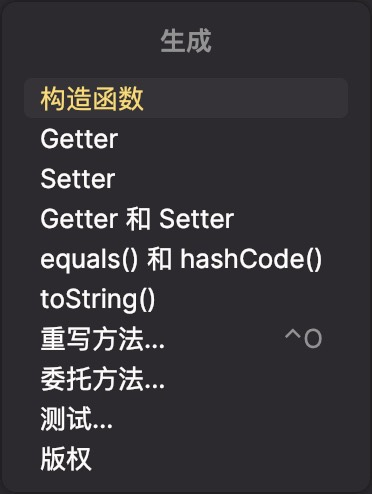
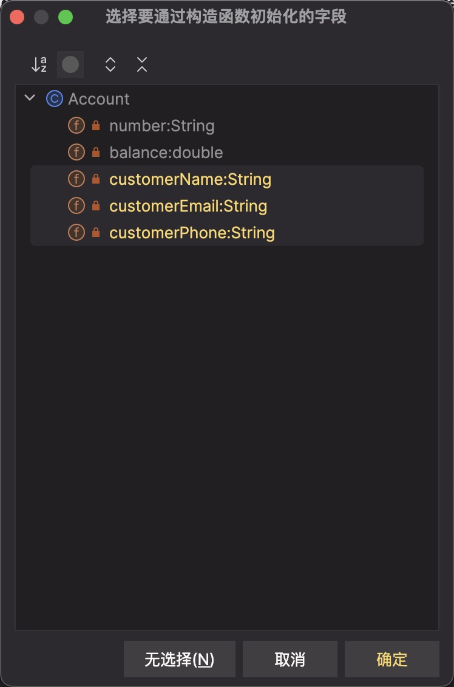
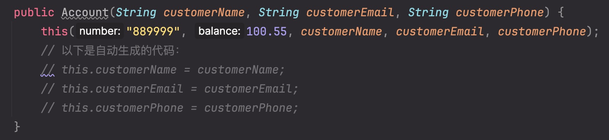

# Constructor 构造函数

构造函数是一个特殊的代码块，当创建 Obj 实例的时候，会执行的方法，他拥有 name 和 params。

**构造函数的 name 与 Class 的 name 是一样的。**并且构造函数**不可以有任何返回值**，任何 type，甚至 void 都不可以。

创建构造函数时，应该使用一个恰当的修饰符，来控制创建新 Class 实例的权限。

```java title="Car.java"
public class Car {  // Class declaration

    public Car() { // Constructor declaration

    // code to be executed as object is created

    }
}
```

## 默认构造函数

当我们的 Class 没有声明构造函数时，则会暗中声明一个默认构造函数。

这个默认构造函数不会有 params，如果你手动创建了构建函数，则不会自动创建。

## 创建构造函数

来看一下自己创建的例子，加深理解(JS 中也使用过类似的构造函数)

```java title="Account.java"
public class Account {
    //highlight-start
    public Account() {
      // no args constructor
      System.out.println("Empty constructor called");
    }
    //highlight-end

    //highlight-start
    public Account(String number, double balance, String customerName, String email, String phone) {
      // constructor with args
      this.number = number;
      this.balance = balance;
      this.customerName = customerName;
      this.customerEmail = email;
      this.customerPhone = phone;

      // 负面例子！虽然执行成功，但是不要这样做，原因查看 #注意事项# 部分
      // error next line
      showDetails();
    }
    //highlight-end

    private String number;
    private double balance;
    private String customerName;
    private String customerEmail;
    private String customerPhone;

    public void showDetails() {
      System.out.println(customerName + " has: $" + balance + " account balance, and the email is: " + customerEmail + " , and the phone is :" + customerPhone);
    }
}
```

```java title="TestClass.java"
Account jeffsAccount = new Account();
jeffsAccount.showDetails();
System.out.println("--------------");
Account jeffsSecondAccount = new Account("12345", 2000, "Jeffrey", "123@gmail.com", "123456789");


// result:
// Empty constructor called
// null has: $0.0 account balance, and the email is: null , and the phone is :null
// --------------
// Jeffrey has: $2000.0 account balance, and the email is: 123@gmail.com , and the phone is :123456789
```

:::tip
JAVA 学习中，让我加深了很多 TS 的理解，比如 Type。

刚刚的 JAVA Class Account 中，创建好的类型就是 Account 类型，TS 中使用 zod 也好，React 也好，使用的时候 type 声明也异曲同工。
:::

### 构造函数的 Overload

刚刚例子也注意到了，创建构造函数的时候，也可以使用 Overload 重载。

我们通过不同数量的 params，来使用了不同的构造函数来创建，并且调用了不同的函数。

## 构造函数 Chaining

构造函数链接，是指一个构造函数调用另一个 Overloading 的构造函数。

:::note 链式构造函数的规则

你只能从**构造函数**中，调用其他构造函数。

必须使用 `this()`，来执行另一个构造函数，并且传递所需要的参数。

如果构造函数是被另一个构造函数调用的，则 **this()必须在第一行调用**。

:::

来看一下例子吧，我们给无参数的构造函数添加了以下代码：

```java title="Account.java"
public class Account {
    public Account() {
      // correct next line
      this("0006868", 500, "Sara", "456@gmail.com", "000111222");

      System.out.println("Empty constructor called");
    }

    ...
    // 后面与之前相同
}
```

也就是说，当我们不传递参数创建实例的时候，默认创建一个 Sara 的账户。

```java title="TestClass.java"
public static void main(String args[]) {
    Account sarasAccount = new Account();
}

// 打印结果如下，成功调用了method
// Sara has: $500.0 account balance, and the email is: 456@gmail.com , and the phone is :000111222
// Empty constructor called
```

## 构建函数注意事项

:::warning 不建议在构建函数中调用任何 Methods
在构造函数中，不建议调用除了构造函数 chaining 外的任何方法，(甚至包括 Setter 等方法，我刚刚例子中调用的 showDetail 就是个负面例子)

**因为在构造函数中，当我们继承，或者创建子 Class 的时候，包括 Setter 等方法可能调用失败。一般情况下建议直接将 Field 赋值。**

```java
this.number = number;
// setNumber(number);  -- don't
```

另一个原因是，**在我们使用构建函数创建实例的时间点，有的方法可能还没有创建成功，直接调用可能导致会报错。**
:::

## IntelliJ 构造函数技巧

假设我们在上面两个构造函数之外，还想要创建一个新的构造函数，我们可以使用一些 IntelliJ 的技巧来帮助我们。

需求：创建一个构造函数，但是只传递 customerEmail, customerName, customerPhone 三个参数。

<details>
  <summary>代码 - 生成(或者 `command + n`) - constructor</summary>
  <div>
  
  </div>
</details>

<details>
  <summary>选择对应Params，生成构建函数。</summary>
  <div>
  
  </div>
</details>

<details>
  <summary>生成效果一览</summary>
  <div>
  
  </div>
</details>

从第三个效果中我们可以看到，我们不仅可以自动生成，还可以调用其他的构造函数，来预设一些值。
