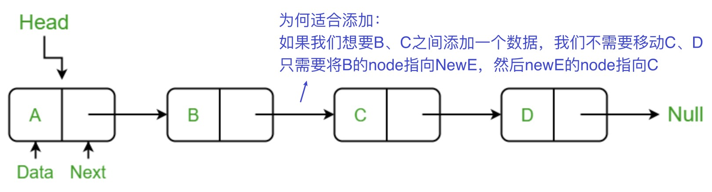

# LinkedList

ArrayList 解决了动态调整数组大小的问题，同时保持了数组的速度。这是通过在内部使用数组，类提供了管理代码，使得程序员不必关心数组是否已满，应该放置在哪里以及如何调整大小。

当然，这意味着它仍然具有数组的一些限制，特别是，在除了末尾之外的任何位置插入新元素都需要移动元素来腾出空间。在我们想要**频繁修改列表结构的情况下，这可能会减慢速度**。

链表（Linked list）是一种常见的基础数据结构，是一种线性表，是由独立组件构成的列表，通常称为节点。

**每个节点存储一个元素，并具有指向下一个节点的链接。列表本身存储了指向第一个节点的链接。**

这意味着一旦找到了想要放置的位置，添加和删除元素就很容易。不过，找到这个位置可能会比较慢。

与 [ArrayList](./arrayList) 相比，LinkedList 的**增加和删除的操作效率更高**，而查找和修改的操作效率较低。

:::info 图解了解一下原理

:::

## 推荐使用 LinkedList 的情况

- 需要通过循环迭代来访问列表中的某些元素。
- 需要频繁的在列表开头、中间、末尾等位置进行添加和删除元素操作。

## 创建 Syntax

```java
// 引入 LinkedList 类
import java.util.LinkedList;

LinkedList<E> list = new LinkedList<E>();   // 普通创建方法

LinkedList<E> list = new LinkedList(Collection<? extends E> c); // 使用集合创建链表

// 初始化直接插入数据
List<Integer> testList = new LinkedList<>(List.of(1,3,2,7,5,8,4));
```

## 方法

[LinkedList 的菜鸟文档](https://www.runoob.com/java/java-linkedlist.html)，还有有很多其他方法 - LinkedList 可以被用作不仅仅是一个列表！

请注意，您永远不会看到 `Node<E>` - 这对外部用户是隐藏的，因为不需要访问内部。

### 添加

add(E element) - 在列表的末尾添加元素。

```java
import java.util.LinkedList;
...

LinkedList<Integer> list = new LinkedList<Integer>();

for (int i = 1; i <= 3; ++i) {
    list.add(i);
}
System.out.println(list);
// [1, 2, 3]
```

#### 指定位置添加

add(int index, E element) - 在指定位置插入元素，必要时将其放在两个元素之间。

#### 添加在最前/最后

`addFirst(元素)`，`addLast(元素)`

```java
import java.util.LinkedList;
...
LinkedList<Integer> list = new LinkedList<>();

for (int i = 1; i <= 3; ++i) {
    list.add(i);
}

// correct-start
list.addFirst(55);
list.addLast(100);
// correct-end
System.out.println(list);
// [55, 1, 2, 3, 100]
```

### 列表包含

contains(Object o) - 如果列表包含 o，则返回 true。

### 查找

get(int index) - 返回指定索引处的元素。

#### 查找最前/最后

通过使用 getFirst 和 getLast 获取最前，最后一个元素。

```java
...
// correct-start
int first = list.getFirst();
int last = list.getLast();
// correct-end
System.out.println(first);
System.out.println(last);
// 1, 3
```

### 查找 index

indexOf(Object o) - 如果列表中包含 o，则返回 o 的索引；如果不包含，则返回-1。

### 删除元素(index)

remove(int index) - 移除指定索引处的元素。这会改变其后的元素的索引，但不需要像 ArrayList 那样移动元素。

#### 删除元素(元素)

remove(Object o) - 移除列表中第一个出现的 o。如果该方法更改了列表，则返回 true。

#### 删除最前/最后

使用 `removeFirst()` 与 `removeLast()` 删除最前与最后一个元素。

```java
...
// correct-start
list.removeFirst();
list.removeLast();
// correct-end
System.out.println(list);
// [2]
```

### 替换

set(int index, E element) - 用指定元素替换指定索引处的元素。

### 查询长度

size() - 返回列表中的元素数量。

```java
...
int size = list.size();
System.out.println(size);
// 3
```

### for-Each 循环

也可以使用 for-Each 循环

```java
...
for (int num : list) {
    System.out.println(num);
}
// 1  2  3
```
