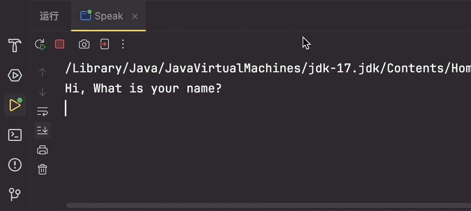
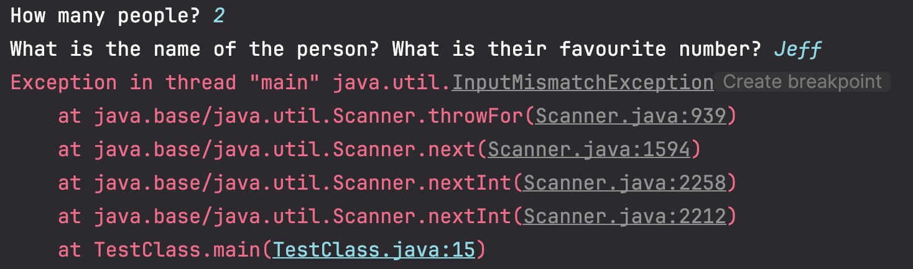
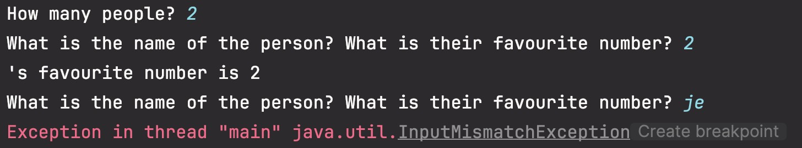
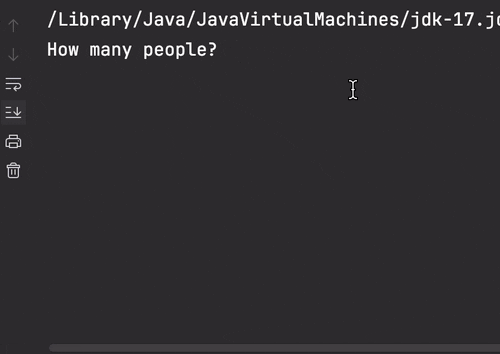

# Scanner 类

Scanner 是 Java5 的新特征，我们可以通过 Scanner 类的**实例**来获取**用户的输入**。

通过 System.in，来读取输入信息。

```java title="创建 Scanner 对象的基本语法"
import java.util.Scanner;
...
Scanner sc = new Scanner(System.in);
```

通过 Scanner 类的 next() 与 nextLine() 方法获取输入的字符串。

在读取前我们一般需要 使用 `hasNext` 与 `hasNextLine` 判断是否还有输入的数据。(逻辑跟 JS 差不多)

:::note PS：读取 File 中的输入
创建 Scanner 类的时候，传入一个 File 类的实例。了解更多 File 类，可以前往[这篇笔记](./fileClass.md)

```java title="读取File中的输入"
Scanner sc = new Scanner(new File("nameOfFileOnFileSystem"));
```

:::

## Methods

[在这里可以看到其他所有的方法](https://www.runoob.com/manual/jdk11api/java.base/java/util/Scanner.html)

| 类型       | 方法                       | 描述                                       |
| ---------- | -------------------------- | ------------------------------------------ |
| BigDecimal | nextBigDecimal()           | 将输入的下一个标记扫描为 BigDecimal 。     |
| BigInteger | nextBigInteger()           | 将输入的下一个标记扫描为 BigInteger 。     |
| BigInteger | nextBigInteger​(int radix) | 将输入的下一个标记扫描为 BigInteger 。     |
| boolean    | nextBoolean()              | 将输入的下一个标记扫描为布尔值并返回该值。 |
| byte       | nextByte()                 | 将输入的下一个标记扫描为 byte 。           |
| byte       | nextByte​(int radix)       | 将输入的下一个标记扫描为 byte 。           |
| double     | nextDouble()               | 将输入的下一个标记扫描为 double 。         |
| float      | nextFloat()                | 将输入的下一个标记扫描为 float 。          |
| int        | nextInt()                  | 将输入的下一个标记扫描为 int 。            |
| int        | nextInt​(int radix)        | 将输入的下一个标记扫描为 int 。            |
| String     | nextLine()                 | 使此扫描器前进超过当前行并返回跳过的输入。 |
| long       | nextLong()                 | 将输入的下一个标记扫描为 long 。           |
| long       | nextLong​(int radix)       | 将输入的下一个标记扫描为 long 。           |
| short      | nextShort()                | 将输入的下一个标记扫描为 short 。          |
| short      | nextShort​(int radix)      | 将输入的下一个标记扫描为 short 。          |

### nextLine

先放一下 nextLine 的使用案例，练习的时候使用了 nextLine 的方法。

nextLine()返回的值就是刚刚输入的值。

```java title="nextLine example"
public static String getInputFromScanner(int currentYear) {
    // 1.创建实例
    // correct next line
    Scanner scanner = new Scanner(System.in);

    System.out.println("Hi, What is your name?");
    // 2.调用实例方法读取输入
    // correct next line
    String name = scanner.nextLine();
    System.out.println("Hi " + name + ", Enjoy the coding!");

    System.out.println("What year were you born?");
    boolean validDOB = false;
    int age = 0;
    do {
        System.out.println("(Please enter a valid year of birth >= " + (currentYear - 125) + " and <= " + (currentYear) + " )");
        age = checkData(currentYear, scanner.nextLine());
        validDOB = age >= 0;
    } while (!validDOB);

    return "So you are " + age + " years old.";
}
```

运行效果：


### next

next 与 nextLine 的使用情景类似，语法也类似，都是调用 Scanner 实例上的方法来获取。

这里是菜鸟文档的示例：

```java
import java.util.Scanner;

public class ScannerDemo {
    public static void main(String[] args) {
        Scanner scan = new Scanner(System.in);
        // 从键盘接收数据

        // next方式接收字符串
        System.out.println("next方式接收：");
        // 判断是否还有输入
        // correct next line
        if (scan.hasNext()) {
            String str1 = scan.next();
            System.out.println("输入的数据为：" + str1);
        }
        scan.close();
    }
}
```

### next 与 nextLine 差别

next() 与 nextLine() 区别

#### next():

- 一定要读取到**有效字符后**才可以结束输入。
- 对输入有效字符之前遇到的**空白**，next() 方法**会自动去掉**。
- 只有输入有效字符后才将其**后面输入的空白**作为**分隔符或者结束符**。

`next() 不能得到带有空格的字符串。`

#### nextLine()：

- 以 Enter 为结束符,也就是说 nextLine()方法返回的是**输入回车之前的所有字符**。
- 可以获得空白。

(逻辑上说，输入 enter 为结束似乎比较好一点)

## 问题

### nextInt 问题

Dr.Luke 演示了一个问题，在这里复现一下

```java
import java.util.Scanner;

class Main {
	public static void main(String[] args) {
		Scanner sc = new Scanner(System.in);

		System.out.print("How many people? ");
		int n = sc.nextInt();
		//3\n

		for (int i = 0; i < n; i++) {
			System.out.print("What is the name of the person? ");
			String name = sc.nextLine();
			System.out.print("What is their favourite number? ");
			int num = sc.nextInt();
			System.out.println(name + "'s favourite number is " + num);
		}
	}
}
```

我们的代码看似没问题，逻辑也正确，但是却报错了？


:::warning 原因
实际上当我们在这一步的时候，发生了一些事情：

```java
int n = sc.nextInt();
//3\n
```

- 我们输入了 3，enter。
- 计算机接收到的信息是 `3\n`
- nextInt()会提取出 3 这个 int，**但是将\n 留在原地**
- 此时的\n 就变成了下一个输入，也就是 `String name = sc.nextLine();`的输入。
- 此时计算机继续前往下一步，想要接收`int num = sc.nextInt();`的输入，而我们刚好输入了"Jeff"
- 因为类型不一致(期望 int，得到 String)，程序报错。

**为了证明，我们可以查看一下**



果然发现，首先是两个问题同时抛出(本应该问题 1-回答-问题 2-回答)，
其次就是打印结果`'s favourite number is 2`

:::

#### 解决办法

结果就是**每一次使用 nextInt()的时候都会发生这个问题**，所以每次都在后面加一个`sc.nextLine();`，提取掉\n 这个字符

```java
import java.util.Scanner;

class Main {
	public static void main(String[] args) {
		Scanner sc = new Scanner(System.in);

		System.out.print("How many people? ");
		int n = sc.nextInt();
        // correct next line
		sc.nextLine();

		for (int i = 0; i < n; i++) {
			System.out.print("What is the name of the person? ");
			String name = sc.nextLine();
			System.out.print("What is their favourite number? ");
			int num = sc.nextInt();
            // correct next line
		    sc.nextLine();
			System.out.println(name + "'s favourite number is " + num);
		}
	}
}
```



### 2 个 Scanner 问题

自己后来的练习中遇到了一个新的问题，导致一直不通过验证。 (code 在本地运行的时候没有出错)

```java title="问题复现"
private static List<Person> readInPeople() {
		//stuff goes here
		List<Person> people = new ArrayList<Person>();
		Scanner scan = new Scanner(System.in);
		System.out.print("How many people are there? ");
		int number = scan.nextInt();
		scan.nextLine();

		for(int i = 1; i <= number; i ++){
			Person newPerson = createOne();
			people.add(newPerson);
		}

		return people;
	}

public static Person createOne(){
        Scanner sca = new Scanner(System.in);
		System.out.println("What type of person is it?");
		System.out.println("1. Student");
		System.out.println("2. Academic");
		System.out.println("3. Code Monkey");
		System.out.print("Enter a choice: ");
		int type = sca.nextInt();
		sca.nextLine();

        ...
        return instanceOfPerson
}
```

:::warning 报错信息如下
Exception in thread "main" java.util.NoSuchElementException
:::

#### 解决办法

查询后发现原因是：关闭了第二个 Scanner，这导致了底层的 InputStream 被关闭，因此第一个 Scanner 无法再从同一个 InputStream 中读取，从而导致了 NoSuchElementException。

解决方案：对于控制台应用程序，请**使用单个 Scanner 从 System.in 中读取**

:::tip
也就是不要同时开启两个 Scanner，只开启一个，将 Scanner 作为参数传进去使用。
:::

```java title="问题解决"
private static List<Person> readInPeople() {
		//stuff goes here
		List<Person> people = new ArrayList<Person>();
		Scanner scan = new Scanner(System.in);
		System.out.print("How many people are there? ");
		int number = scan.nextInt();
		scan.nextLine();

		for(int i = 1; i <= number; i ++){
            // correct next line
			Person newPerson = createOne(scan);
			people.add(newPerson);
		}

		return people;
	}
// correct next line
public static Person createOne(Scanner sca){
        // error next line
        // Scanner sca = new Scanner(System.in);
		System.out.println("What type of person is it?");
		System.out.println("1. Student");
		System.out.println("2. Academic");
		System.out.println("3. Code Monkey");
		System.out.print("Enter a choice: ");
		int type = sca.nextInt();
		sca.nextLine();

        ...
        return instanceOfPerson
}
```
