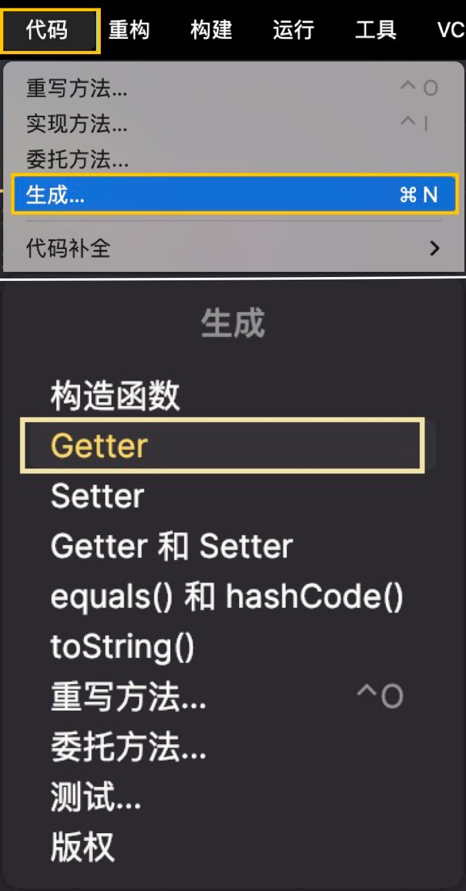

# Setter & Getter

作为 OOP，Class 编程的一部分，Setter 与 Getter 有着很重要的作用。

我们设置了这样的规则，来防止字段被自由的篡改，保护了数据的完整性，与 Class 内部的可修改性（自己创造的一个词，既包括了可维护性，也是可扩展性，总之有益于一切需要修改代码的行为）。

这么想想，React 的钩子(如 useState)也是类似的原理，防止你修改数据，需要使用 getter 与 setter 来获取，设置数据。

## 例子

我们使用这个例子，来解释一下 Getter 和 Setter

```java title="CarClass"
public class Car {
    // public String getMake() {
    //     return make;
    // }

    // public void setMake(String make) {
    //     this.make = make;
    // }

    private String make;

    public void describeCar() {
        System.out.println(make + " car");
    }

}
```

## Getter

在私有字段中(private field)，我们在外部是无法直接设置，或者使用该字段的。一个例子可以从[这篇笔记](./modifiers)的 private 部分中看到。

但是我们可以通过设置一个 getter 函数，来获取到对应的值。

### IDE 自动设置

与 JS 不同，我们在 IntelliJ 中，可以通过一键自动设置 Getter，省去手动编写的复杂。

<details>
  <summary>代码 - 生成(或者 `command + n`) - getter</summary>
  <div>
  
  </div>
</details>

<details>
  <summary>选择对应字段，来自动生成 getter 函数。</summary>
  <div>
  
  </div>
</details>

<details>
  <summary>生成效果一览</summary>
  <div>
  
  </div>
</details>

### 代码演示

在 Car Class 中，我们为私有字段创建了一个 getter 方法 (当然，此方法必须是 `public method`)，

**来返回私有字段 make 的值**

```java title="Car.java"
public String getMake() {
    return make;
}
```

此时，我们可以在其他地方使用此方法，来获取私有字段了。

```java title="TestClass.java"
public static void main(String args[]) {
    Car newCar = new Car();
    newCar.describeCar();
    // error next line
    // System.out.println(newCar.make);       // 报错，无法访问private字段

    //correct next line
    System.out.println(newCar.getMake());     // Result： Mazda
}
```

## Setter

我们在 Class 中创建 Setter， 用来**设置私有字段值**的，封装成一个 public method。

:::warning
注意，Setter 不应返回任何值，他应该是单纯是设置。
:::

### IDE 自动设置

与上面 Getter 的方法相同，只是需要选择设置 Setter。

### 代码演示

此处将 Car 中的私有字段(this.)make，变成传入的 make 参数。

:::note
this 也是老朋友了--指向实例本身。JAVA 中的 this 似乎没有 JS 中的 this 那么复杂。

[点击回顾 JAVA 的 this 与 super 笔记](../OOP/inheritance#super--this)

[点击回顾 JS 的 this 笔记] --还没补，回头再说
:::

```java title="Car.java"
public void setMake(String make) {
    this.make = make;
}
```

当我们使用 setMake()设置后，我们可以成功的打印出结果了。

```java title="TestClass.java"
public static void main(String args[]) {
    Car newCar = new Car();
    System.out.println(newCar.getMake()); // null
    // highlight-next-line
    newCar.setMake("Mazda");
    System.out.println(newCar.getMake());  // Mazda

```
