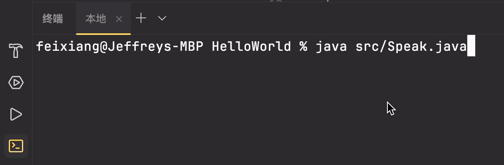

# 内置常用语句

JAVA 内置的常用方法/语句，大部分用来操作数据，了解数据。

## JAVA 读取数据语句

### System.in

### System.console

System.console 不可以直接运行，需要在终端手动运行(类似 node 的运行方式)

#### readLine

`readLine()` 可以读取 console 中输入的字段。

```JAVA title="Syntax"
System.console().readLine()
```

使用案例：

```JAVA
public class Speak {
    public static void main(String[] args) {
        int currentYear = 2024;
        System.out.println(getInputFromConsole(currentYear));
    }

    public static String getInputFromConsole(int currentYear) {
        String name = System.console().readLine("Hi, What is your name?");
        System.out.println("Hi " + name + ", Enjoy the coding!");

        return "";
    }
}
```

运行演示：


### 命令行 Args

### Scanner

```

```
