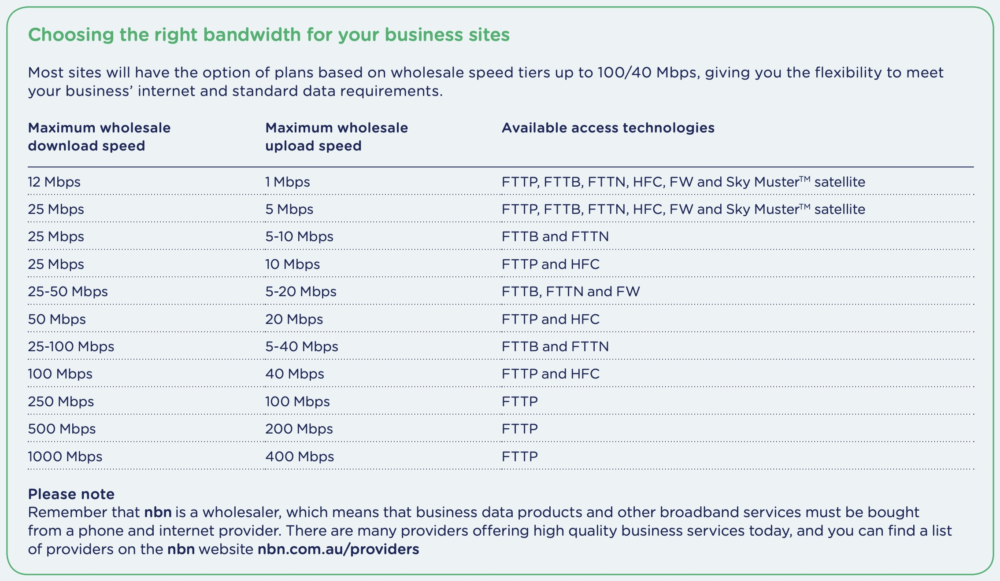

# 互联网基础

互联网由很多的终端组成，他们互相连接，互相交流。

## 构成

Billions of connected computing devices

### Hosts 主机

hosts = end systems(端系统)

#### Internet’s edge

主机就是端系统，即互联网最边缘(Internet’s edge)，与互联网相连的计算机或者其他设备(数据中心的 server)。

如 laptop，desktop，mobile，console 等，还有 server 也是。

他们通过有线或者无线的 **Communication links** 来链接网络

终端链接到网络最后这部分，也被称为 Last Mile Problem

- home network
- residential access nets
- enterprise networks (school, company)
- mobile networks (WiFi, 4G/5G)

#### 基础设施 Infrastructure 功能

- 运行程序
  - 网络、流媒体视频、多媒体电话会议、电子邮件、游戏、电子商务、社交媒体、互连设备等等功能。
- 产生信息并将信息传入网络，或者从网络接受数据并提供给程序
  - 例如 API。允许发送/接收应用程序“连接”，使用互联网传输服务
  - API Protocols： HTTP (Web)、streaming、Zoom、TCP/IP、

### Communication links 通信链路

fiber - 光纤, copper - 铜缆, radio - 无线电, satellite - 卫星，等等

他们的传输速率 transmission rate 取决于 **带宽 bandwidth**

### Packet Switches 分组交换机

forward packets (chunks of data - 也就是数据的中间件)

包括 `routers 路由器`, `switches 链路层交换机`

### Networks 网络

由设备 devices，路由器 routers，links: managed by an organization 等等构成

#### network of networks

Interconnected ISPs

#### 网络协议

网络协议管理信息的收发，如 WiFi, 4G, Ethernet, ADSL, HFC

#### 互联网 standards

RFC: Request for Comments

IETF: Internet Engineering Task Force

### 访问网络

#### DSL

**Digital Subscriber Line**, use existing dedicated telephone line to central office DSLAM(复用器)

- 数据通过 DSL phone line goes to Internet
- 声音 over DSL phone line goes to telephone net

24-52 Mbps dedicated downstream transmission rate
3.5-16 Mbps dedicated upstream transmission rate

#### HFC

Hybrid Fiber Coax - 混合光纤同轴电缆

先用同轴电缆接入光纤节点，再用光纤连接到头端

asymmetric: up to 40 Mbps – 1.2 Gbs downstream transmission rate,
30-100 Mbps upstream transmission rate

#### NBN

There are six main methods used to connect homes to the nbn network.

1. Fibre to the Premises/Home (FTTP/FTTH)
   光纤直接引入用户的住宅，FTTP 通常被认为是性能最高的 NBN 连接类型。
   由于铺设新光纤到每个单独的安装点的复杂性和成本，它也是最不常见的。
2. Fibre to the Node (FTTN)
   最常见的 NBN 连接类型是光纤到节点和光纤到建筑物。
   FTTN 将光纤引入到您街道上（或附近街道）的一个中心点，称为“节点”。从这里，它利用现有的铜线基础设施连接到您住宅内的墙插。
3. Fibre to the Building (FTTB)
   FTTB 是单位、公寓楼和许多商业建筑物的最常见连接类型。
   与 FTTN 类似，光纤引入建筑物通信室的中心点，然后通过已经存在的内部布线（通常是旧建筑物中的铜线，或者是新建筑物中的以太网电缆）连接到您的住宅。
4. Fibre to the Curb (FTTC)
   光纤引入到您家外的一个小型通信井或杆，FTTC 位于更复杂的 FTTP 连接和更简单但潜在性能较低的 FTTN 连接之间。通常情况下，与光纤到节点连接相比，它提供更快的潜在速度，因为光纤网络距离您的连接点更近。
5. Hybrid Fibre Coaxial (HFC)
   HCF 连接利用现有的有线电视技术。光纤引入到您街道上的一个节点，最后一段同轴电缆连接到您的住宅。它具有提供快速下载速度的潜力，并且通常与我们的超快和超高速 NBN 附加服务兼容。
6. Fixed Wireless
   这种技术用于区域地区，无法实际铺设物理光纤来连接网络。在屋顶安装固定天线，接收来自您当地 NBN 无线塔的信号。然后，内部布线将引导到您住宅内部的 NBN 连接盒。

#### data-rates

## 协议 Protocols

:::tip 什么是协议？

Protocols define the format, order of messages sent and received among network entities, and actions taken on msg transmission, receipt

也就是规定了收发消息的格式、顺序以及消息传输、接收所采取的操作。就像后端给前端的 doc 一样。
:::
