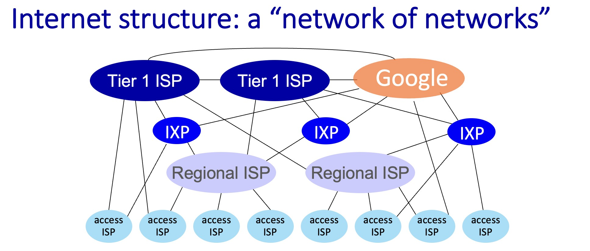

# 互联网基础

互联网由很多的终端组成，他们互相连接，互相交流。

## 构成

互联网主要由三部分组成，`互联网边缘`(PC，Laptop、服务器、其他智能终端设备)，`接入网和物理介质`(线缆，路由，蜂窝塔)，`网络核心`(分组交换设备和通信链路构，网状网络)。

## 网络边缘 Internet’s edge

互联网最边缘(Internet’s edge)，与互联网相连的 Hosts 主机(也叫做 end systems 端系统 )或者其他设备(数据中心的 server)

如 laptop，desktop，mobile，console， server 等。

他们通过有线或者无线的 **Communication links** 来链接网络

终端链接到网络最后这部分，也被称为 Last Mile Problem。

- home network
- residential access nets
- enterprise networks (school, company)
- mobile networks (WiFi, 4G/5G)

### 主机的功能 Infrastructure

- **运行程序**
  - 网络、流媒体视频、多媒体电话会议、电子邮件、游戏、电子商务、社交媒体、互连设备等等功能。
- **产生信息**并将信息传入网络，或者从网络**接受信息**并提供给程序
  - 例如 API。允许发送/接收应用程序“连接”，使用互联网传输服务
  - API Protocols： HTTP (Web)、streaming、Zoom、TCP/IP

## 接入网 Access networks

Host 首先连接到边缘路由器 edge router，再连接到互联网。

边缘路由器会有多种不同方式来链接互联网，比如 DSL，HFC，NBN 等物理线路。

:::info 边缘路由器
边缘路由器 edge router 是端系统 Host 去往任何其他远程端系统的路径上的**第一台路由器**
:::

如何将 Host 链接到 edge router？有多种不同的方法，有线方法，无线方法。

### 有线 Wired

wired 有线链接接入网络。

有线方式从古至今有很多种，光纤到户 FTTH，以太网，同轴电缆，双绞线的 DSL，古老的拨号上网。

#### DSL

DSL 是数字用户线 Digital Subscriber Line 的缩写，这是访问互联网时一种比较古老的方法，主要用于家庭和企业通过电话线发送和接收数据（可同时传输语言和数据）。

- 使用现有的专用电话线连接到中央局的复用器(DSLAM)
- 数据通过 DSL 到达互联网 Internet
- 声音通过 DSL 到达电话网络 telephone net
- 下行传输速率为 24-52 Mbps，专用上行传输速率为 3.5-16 Mbps

:::tip
听上去有点类似拨号，但事实上，DSL 是一种优于拨号连接的技术，因为 DSL 可以同时支持上网和打电话，但拨号连接只能支持上网或打电话。
:::

#### HFC 混合光纤同轴

HFC (Hybrid Fiber Coax) 网络系统是介于全光纤网络和早期 CATV 同轴电缆网络之间的一个系统，它具有频带宽、用户多、传输速率高、灵活性和扩展性强及经济实用的特点，为实现宽带综合信息双向传输提供了可能，许多厂商都在瞄准这一领域。

- 非对称：下行传输速率为最高 40 Mbps 至 1.2 Gbps，上行传输速率为 30-100 Mbps
- 电缆和光纤网络连接家庭到 ISP 路由器
- 家庭共享接入网络到电缆主机端 (homes share access network to cable head end)

:::tip
先用同轴电缆接入光纤节点，再用光纤连接到头端
:::

:::info
HFC（混合光纤同轴电缆）的 bandwidth 是用户之间共享的，在**下行 HFC 信道**中，所有数据包都源自一个单一的来源，即总部端（head end），用户之间不会发生碰撞 no collisions 。
:::

#### NBN

NBN 是澳洲国家网络，由多种不同的方式来链接到 NBN 网络。

There are six main methods used to connect homes to the nbn network.

1. Fibre to the Premises/Home (FTTP/FTTH)
   光纤直接引入用户的住宅，FTTP 通常被认为是性能最高的 NBN 连接类型。
   由于铺设新光纤到每个单独的安装点的复杂性和成本，它也是最不常见的。
2. Fibre to the Node (FTTN)
   最常见的 NBN 连接类型是光纤到节点和光纤到建筑物。
   FTTN 将光纤引入到您街道上（或附近街道）的一个中心点，称为“节点”。从这里，它利用现有的铜线基础设施连接到您住宅内的墙插。
3. Fibre to the Building (FTTB)
   FTTB 是单位、公寓楼和许多商业建筑物的最常见连接类型。
   与 FTTN 类似，光纤引入建筑物通信室的中心点，然后通过已经存在的内部布线（通常是旧建筑物中的铜线，或者是新建筑物中的以太网电缆）连接到您的住宅。
4. Fibre to the Curb (FTTC)
   光纤引入到您家外的一个小型通信井或杆，FTTC 位于更复杂的 FTTP 连接和更简单但潜在性能较低的 FTTN 连接之间。通常情况下，与光纤到节点连接相比，它提供更快的潜在速度，因为光纤网络距离您的连接点更近。
5. Hybrid Fibre Coaxial (HFC)
   HCF 连接利用现有的有线电视技术。光纤引入到您街道上的一个节点，最后一段同轴电缆连接到您的住宅。它具有提供快速下载速度的潜力，并且通常与我们的超快和超高速 NBN 附加服务兼容。
6. Fixed Wireless
   这种技术用于区域地区，无法实际铺设物理光纤来连接网络。在屋顶安装固定天线，接收来自您当地 NBN 无线塔的信号。然后，内部布线将引导到您住宅内部的 NBN 连接盒。

:::info FTTH

光纤到户 FTTH (Fiber To The Home)

全球先进地区普遍采用的光纤通信的传输方法。带宽大、线路稳定。
:::

### 无线 Wireless

wireless 无线链接接入网。

#### 无线局域网 Wi-Fi

无线局域网，目前现代家里常用的方法。通常在建筑物内或周围（30 米）

802.11b/g/n (WiFi): 11, 54, 450 Mbps transmission rate

#### 广域蜂窝接入网

Wide-area mobile access networks，或者叫做 **cellular**

一般由移动蜂窝网络运营商提供 provided by mobile, cellular network operator （10 公里）

2G/3G/4G/5G 等蜂窝网络， 0.1 ~ 1000 Mbps 速率

### Home & Enterprise

现实中的接入网一般是由有线和无线等多种技术混合的。(包括 WiFi 和 4G 等多种无线技术的混合接入)

- 有线以太网接入
  - 100Mbps、1Gbps、10Gbps 等接入速率
- 无线 WiFi 接入
  - 11、54、450Mbps 等

    
点击查看企业与家庭接入网

    

      
    

## 物理介质 Physical Media

physical media 是指发射机和接收机之间的具体链路介质，一般是 `Guided Media 引导型介质`与 `Unguided Media 非引导型介质`。物理介质传输 `bit`数据。

:::note bit 比特

发射机/接收机之间的物理介质上传播的数据的最小单元，用比特表示（bit）。

:::tip
通常的存储位字节 Byte，1 Byte = 8 bits

:::

### 引导型介质 Guided Media

引导型介质 guided media：信号传输 (propagate) 的固体媒介。如: copper, fiber, coax (铜、光纤、同轴电缆)

:::note Twisted pair (TP)

双绞线（Twisted Pair）两根绝缘铜线互相缠绕为一对 two insulated copper wires。

电话线为 1 对双绞线，网线为 4 对双绞线，广泛用于计算机网络（以太网）双向传输。

Category 5: 100 Mbps, 1 Gbps Ethernet
Category 6: 10Gbps Ethernet

:::

:::note Coaxial cable

同轴电缆(Coaxial cable)：两根同心铜导线组成，双向传输电缆上**多个频率通道** (multiple frequency channels)

带宽可达 100 Mbps per channel
:::

:::note Fiber optic cable:

光纤电缆：携带光脉冲的玻璃纤维，每个脉冲表示一个比特(glass fiber carrying light pulses, each pulse a bit)

高速度运行：
是光在玻璃中的速度。高速点对点传输 high-speed point-to-point transmission (10-100 Gbps)

low error rate:
中继器间距较远 repeaters spaced far apart，且免疫电磁噪声 immune to electromagnetic noise
:::

### 非引导型介质 Unguided Media

非引导型介质 unguided media 允许信号自由传播，例如无线电 Radio(地无线电、卫星无线电信道)

:::note 无线电 Wireless radio

- 信号携带在电磁频谱(electromagnetic spectrum)中
- no physical “wire”
- 不依赖介质的广播
- 半双工（发送方到接收方）
- 传播过程 propagation 中会收到环境影响，如传播环境影响：反射 reflection，被物体阻挡 obstruction by objects，干扰 interference
  :::

:::note 无线链路类型 Radio link types

- **无线局域网 WiFi**
  - 10-100 Mbps；10 米
- **广域 wide-area (cellular)**
  - 如 3/4/5G 蜂窝，在 10 公里范围内
- **蓝牙 Bluetooth**
  - 短距离，有限速率
- **地面微波 terrestrial microwave**
  - 点对点；45 Mbps
- **卫星 Satellite**
  - 每个信道高达 45 Mbps
  - 同步卫星：36000km 高空， 270 毫秒的往返时延 270 msec end-end delay
  - 低轨卫星：近地，但围绕地球高速运动，需要大量卫星才能覆盖地球

:::info
马斯克的星链计划 - 采用低轨卫星降低通信时延
:::

## 网络核心 Network Core

将海量的端系统互联起来，由各类交换机（路由器）和链路，构成的网状网络。

主要由两大功能构成，包括路由和转发。

:::info 网络核心的两大功能

`Forwarding 转发` 与 `Routing 路由`是网络核心的两大功能。

Forwarding 转发是一个本地动作，将到达的 data packets 从路由器的输入 link 移动到相应的路由器输出 link。

而 Routing 路由是一个全局动作：确定数据包所采用的源到目的地路径，路由算法
:::

其中转发中的一个重要的概念就是分组交换 packet-switching。

### 分组交换 packet-switching

分组交换就是：主机终端将 application-layer 的数据分成小 packets，通过网络传输。每个分组包含源地址、目标地址以及其他路由所需的信息。

然后转发数据，Forward packets from one router to the next, across links on path from source to destination

每个数据包以满链路容量传输。

**路径** -- 分组可以采用不同的路径到达目的地，可能会因网络拥塞而导致分组乱序或延迟。

优点：

- 带宽利用效率高：分组交换因为带宽在多个用户之间共享，只在需要传输数据时分配资源，因此效率高。
- 灵活性：分组交换灵活，可以处理各种数据速率和分组大小。
- 可扩展性强：分组交换在网络上可以处理大量的流量。
- 成本较低：分组交换比电路交换成本低，因为资源在多个用户之间共享。

缺点：

- 较高的延迟：分组交换因为分组必须经过多个节点路由，可能会导致延迟。
- 有限的服务质量（QoS）：分组交换提供有限的服务质量保证，不同类型的流量可能被平等对待。

:::info 终端发送功能

- 接收来自应用层 application-layer 的消息
- 将其分解为长度为 L 位的 chunks，称为 packets
- 以 transmission rate R ，将数据包传输到接入网
  - transmission rate R - 链路传输速率，也就是带宽 link bandwidth (link capacity)

:::

#### 延迟的计算

关于延迟的计算，丢包，吞吐量等，放入了[**这篇笔记中**](./fun1_3_delays)。

#### 分组交换技术

使用了`存储转发技术` store-and-forward

- 数据分组传输延迟
  - 需要 L/R 秒才能将 L 位数据包以 R bps 的速率传输（push）到 link 中
- 存储和转发
  - 路由器需要接收到完整的数据 entire packet 分组以后，才能开始下一跳发送 transmitted on next link

#### 例题

:::note 例题
Suppose users share a 2 Mbps link. Also suppose each user transmits continuously at 1 Mbps when transmitting, but each user transmits only 20 percent of the time.

Probability that a given user is transmitting? 这个就是问 user 正在传输数据的概率，一般会在题目中给出。

这里就是 0.2，因为每个用户 20%时间在传输。

Suppose now there are three users. Find the probability that at any given time, all three users are transmitting simultaneously. Find the fraction of time during which the queue grows.

这个就是`0.2^3` = 0.008，就是同时三个人传输，并造成网络排队延迟的概率。
:::

### 电路交换 Circuit Switching

在电路交换中，数据传输开始之前，会在两个设备之间建立一个**专用的通信路径**，实现端到端的资源预留，也就是电路。

**路径** -- 电路交换连接建立后，物理路径会被通信双方独占，资源专用，即使空闲也不与其他连接共享

电路交换通常用于**语音通信**和**某些类型的数据通信**

电路交换非常适合应用程序涉及到 - 具有可预测、平滑带宽需求的长会话 (long sessions with predictable smooth bandwidth requirements)。

优点：

- 带宽保证：电路交换为通信提供了专用路径，确保通话期间的带宽得到保证。
- 低延迟：电路交换因为路径预先确定，无需为每个数据包建立连接，因此具有低延迟。
- 可预测的性能：电路交换的带宽被预留，资源不会被其他设备占用，因此性能可预测。
- 适用于实时通信：电路交换适用于实时通信，如语音和视频，因为它提供低延迟和可预测的性能。

缺点：

- 带宽利用效率低：电路交换因为整个通话期间都保留带宽，即使没有数据传输，效率较低。
- 可扩展性有限：电路交换的可扩展性有限，因为可以建立的电路数量是有限的，从而限制了同时通话的数量。
- 成本高：电路交换成本较高，因为需要在通话期间使用专用资源，如硬件和带宽。

#### FDM

Frequency Division Multiplexing (FDM) 频分多路复用

- 光学和电磁频率被分成（窄带）频段 optical, electromagnetic frequencies divided into (narrow) frequency bands

- 每个通话被分配到自己的频段，可以以该窄带的最大速率传输 each call allocated its own band, can transmit at max rate of that narrow band

#### TDM

Time Division Multiplexing (TDM) 时分多路复用

其中时间被分成时隙 time divided into slots

每个通信信道或呼叫被分配了周期性的时隙 periodic slot(s)，允许它以更宽的频带的最大速率进行传输，但仅在指定的时间段内进行传输。

### 比较交换方式

    
点击查看比较交换方式

    

      
    

### 交换方式例题

:::note 例题 1

   
点击查看例题1

   

      

         gives a formula for the end-to-end delay of sending one packet of length L over N links of transmission rate R. Generalize this formula for sending P such packets back-to-back over the N links.
      

      

         N*(L/R) + (P-1)*(L/R)
      

      

         在时间 N*(L/R)，第一个数据包已经到达目的地，第二个数据包存储在最后一个路由器中，第三个数据包存储在倒数第二个路由器中，依此类推。在时间 N*(L/R) + L/R，第二个数据包已经到达目的地，第三个数据包存储在最后一个路由器中，依此类推。按照这种逻辑继续下去，我们可以看到在时间 N\*(L/R) + (P-1)(L/R) = (N+P-1)(L/R) 时，所有数据包都已经到达了目的地。
      
      
   

:::

:::note 例题 2

   
点击查看例题2

   

   <h4>
      Consider an application that transmits data at a steady rate 稳定速率传输数据 (for example, the sender generates an N-bit unit of data every k time units, where k is small and fixed 发送方每 k 个时间单位生成一个 N 比特的数据单元，其中 k 很小且固定). Also, when such an application starts, it will continue running for a relatively long period of time 长时间运行. Answer the following questions, briefly justifying your answer:
   </h4>
   <h5>
      a. Would a packet-switched network or a circuit-switched network be more appropriate for this application? Why? 对于这种应用程序，分组交换网络还是电路交换网络更合适？为什么？
   </h5>
   

      A circuit-switched network would be well suited to the application, because the application involves long sessions with predictable smooth bandwidth requirements. Since the transmission rate is known and not bursty, bandwidth can be reserved for each application session without significant waste. In addition, the overhead costs of setting up and tearing down connections are amortized over the lengthy duration of a typical application session.
      电路交换网络非常适合该应用程序，因为该应用程序涉及具有可预测、平滑带宽需求的长会话。由于传输速率是已知的且不是突发性的，因此可以为每个应用程序会话预留带宽，而不会出现显着的浪费。此外，建立和拆除连接的开销可以在典型应用程序会话的长时间内摊销
    

    <h5>
      b. Suppose that a packet-switched network is used and the only traffic in this network comes from such applications as described above. Further-more, assume that the sum of the application data rates is less than the capacities of each and every link. Is some form of congestion control needed? Why? 假设使用分组交换网络，并且该网络中的所有流量都来自上述描述的应用程序。而且，进一步假设应用程序数据速率的总和小于每个链路的容量。是否需要某种形式的拥塞控制？为什么？
   </h5>
   

      In the worst case, all the applications simultaneously transmit over one or more network links. However, since each link has sufficient bandwidth to handle the sum of all of the applications' data rates, no congestion (very little queuing) will occur. Given such generous link capacities, the network does not need congestion control mechanisms.
      在最坏的情况下，所有应用程序同时在一个或多个网络链路上传输。然而，由于每个链路的带宽足以处理所有应用程序数据速率的总和，因此不会发生拥塞（排队很少）。考虑到如此宽裕的链路容量，网络不需要拥塞控制机制。
   

:::

:::note 例题 3

    
点击查看例题3

    

      
    

:::

## 网状网络 network of networks

网络主机通过接入互联网服务提供商（ISPs）连接到互联网。

住宅、企业（公司、大学、商业）等 ISP。接入 ISP 必须相互连接，以便任何两个主机都可以相互发送数据包。

ISP 就是 Internet Service Provider，网络供应商。

ISP 有不同的等级，其中 tier 1 是全球最高级别 ISP，互不结算(中国电信，澳洲 Telstra)，tier 2(edu,UTS)

:::note 两个同一层次结构 ISP 之间相互连接或直接对等
如果两个互联网服务提供商之间不相互连接，那么当它们彼此发送流量时，它们必须通过一个 provider ISP 提供商互联网服务提供商（中介）发送流量，这需要它们支付费用。

通过直接相互连接，两个互联网服务提供商可以减少 provider ISPs 费用。
:::

  
点击查看网络结构

  

    
  

:::info Internet Exchange Points
互联网交换点（IXP）（通常位于独立建筑物中，具有自己的交换机）是多个 ISP 可以连接和/或相互互联的交汇点。ISP 通过向连接到 IXP 的每个其他 ISP 收取相对较小的费用来赚取钱，这可能取决于发送到 IXP 或从 IXP 接收的流量量。
:::
