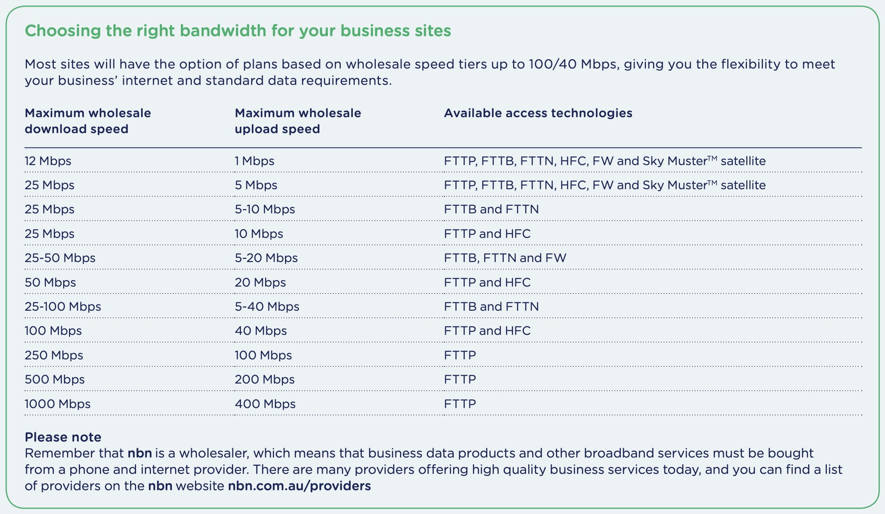

# 网络协议与层级

网络协议 network protocol 为了进行网络中的**数据交换**而建立的规则、标准 或约定。如 WiFi, 4G, Ethernet, ADSL, HFC，这些协议帮助传输信息。

:::tip Define

Protocols define the format, order of messages sent and received among network entities, and actions taken on msg transmission, receipt

也就是规定了收发消息的格式、顺序以及消息传输、接收所采取的操作。就像后端给前端的 doc 一样。
:::

这里有五个层级，每个层级都有不同的协议，来传输数据。

:::tip 为什么要分层？

- 为了处理复杂系统的方法
  - 明确的结构允许识别和了解复杂系统的各个部分之间的关系
- 分层参考模型用于讨论
  - 模块化简化了系统的维护和更新
- 对层服务实现的更改
  - 对系统的其他部分是透明的
  - 例如，门禁程序的更改不会影响系统的其他部分
  - 专注于做好擅长的事情

:::

:::info
Routers process network, link and physical layers (layers 1 through 3). (This is a little bit of a white lie, as modern routers sometimes act as firewalls or caching components, and process Transport layer as well.)

Link layer switches process link and physical layers (layers 1 through2).

Hosts process all five layers.

路由器处理网络 network、链路 link 和物理层 physical（第 1 到第 3 层）。（这有点夸大其词，因为现代路由器有时会充当防火墙或缓存组件，并处理传输层。）链路层交换机处理链路 link 和物理层 physical（第 1 到第 2 层）。主机处理所有五层。
:::

## 五 应用层 Application Layer

支持网络应用程序。IMAP，SMTP，HTTP

## 四 传输层 Transport Layer

进程之间的数据传输。TCP，UDP

## 三 网络层 Network Layer

从源到目的地的数据报路由。IP，路由协议

## 二 数据链路层 Data Link Layer

相邻网络元素之间的数据传输。以太网，802.11（WiFi），PPP

## 一 物理层 Physical Layer

传输介质上的 Bit

## 封装 与 解封装

在层级传递的时候，会有封装与解封装的过程。

封装 Encapsulation 是将数据包从更高的层传递到更低的层的过程。在最简单的情况下，它只是将额外的信息（即标头）附加到源数据包上。在更复杂的情况下，原始数据包可以被分割成多个数据包，每个数据包都携带自己的标头。

解封装 Decapsulation 是封装的相反过程。它从更低的层中的源数据包中提取标头，并将有效载荷传递给更高的层。如果较低层的数据包是序列的一部分，则将相应的有效载荷组合在一起，然后将它们传递到更高的层。协议栈中的每个协议都依赖于较低层的服务，但不依赖于其信息。因此，一个协议处理数据包所需的信息应完全包含在该协议的标头中。封装和解封装是灵活的机制，允许每个协议独立于其他协议运行，同时能够与其他协议进行接口交互。

## 互联网 standards

RFC: Request for Comments

IETF: Internet Engineering Task Force

## data-rates

