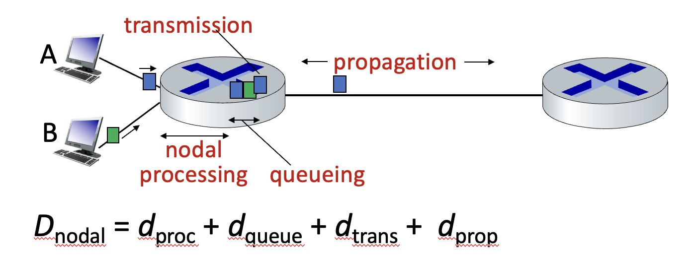
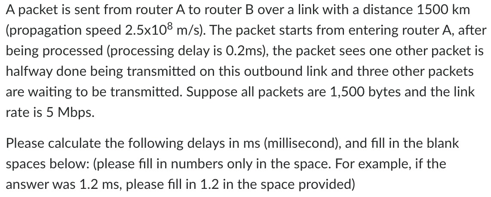
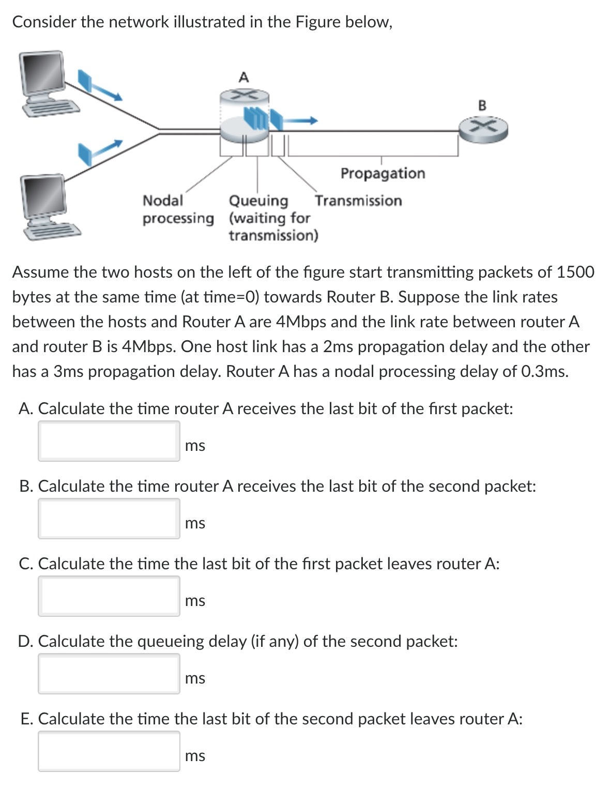

# 延迟计算

计算网络延迟很重要，所以单独开一篇。

## 总延迟

从一个 Packet 发出，到达本地路由，再发送至目标路由，延迟由四部分组成。

:::tip RTT
往返时延 RTT(Round-Trip Time)
从发送方发送数据开始，到发送方收到来自接收方的确认，经历的总时间。

可用于判断网络的通断性、测试网络时延、计算数据包丢失率等
:::

### Nodal Processing Delay 处理延迟

第一部分为**节点处理**延迟。

这部分延迟很小，因为是检查一些 bit 错误，判断输出地址，一般小于毫秒。

:::info 节点处理延迟
一般情况下，节点处理延迟会直接给出。如 0.2ms
:::

### Transmission Delay 数据传入延迟

这个部分十分重要，这部分是数据从**路由器进入光纤**的延迟。

计算公式为 `L/R`，直接计算结果为 s，如果需要 ms，则要\*1000。

:::info L/R
L：数据大小 packet length (bits)。如果数据为 byte，则要\*8 变为 bits (1byte = 8bits)

R：数据传输速率 link transmission rate (bps)。如果给出 mbps，则要\*1,000,000 (m 就是 million)
:::

:::tip
如果是从 Host 出发，经过传输，到达 RouterA，要计算进入 RouterA 的 L/R。

后面离开 RouterA，还要计算新的 L/R (R 为后半段的速率)
:::

### Queueing Delay 排队延迟

在我们进入光纤之前，前面也会有其他的 Packet 在进入光纤。我们就需要等待他们先进入光纤，之后才能处理我们。

这个就是**排队延迟**。

:::info 排队延迟
排队延迟计算方式很简单，前面有几个 packet 在排队，就计算几次 Transmission Delay 数据传入延迟。

例如 4.5 个排队，即 4.5 \* L/R
:::

#### 公式

:::tip 什么时候没有 Queuing delay
假设两个同样大小的包，从两个不同地方发出，分别是 d1 和 d2 的延迟，到达路由器 A 的传输速率分别是 R1 和 R2。
如果路由 A 到路由 B 之间的传输速率是 R，什么时候没有排队延迟？

Assume d1 < d2. No buffering occurs when d2 + L / R2 > d1 + L / R1 + L / R.

(也就是 [D_prop_慢 + D_trans_慢] 的时间要大于 [D_prop_快 + D_trans_快 + D_trans_快]， 慢的那个得在快的那个进入 A 又离开 A 之后再到达。)
:::

### Propagation Delay 物理传输延迟

进入光纤后，Packet 从光纤一端到达另一端的时间。

计算公式为 `d/s`, 直接算结果为 s，如果需要 ms，则要\*1000。

:::info D/S
d：线缆长度 length of physical link，单位为 m。如果为 km，记得转换。

s：传输速度 propagation speed (一般为**光在玻璃中的传输速度**，2\*10^8 m/s)
:::

### 总结与例子

以上四个延迟相加，我们就得到了整个节点的延迟。

- 1 数据处理，大概 1-2ms
- 2 排队延迟，前面有 N 个数据在传入光纤，就用 N\*L/R
- 3 传入延迟，自己的数据大小 L / 传入速率 R = 多久进入光纤
- 4 运输延迟，光纤线缆长度 m /传播速度 光速 = 通过光纤的时间

:::tip
All of these delays are fixed, except for the queuing delays, which are variable.
除了 Queuing Delay，其他都是固定的。
:::

#### 延迟计算例子

:::note 计算结果

- 数据处理延迟 0.2ms
- 传入延迟为 2.4ms
  - (1500\*8) / 5,000,000 = 0.0024s = 2.4ms
- 排队延迟为 8.4ms
  - 3.5 \* 2.4 = 8.4 ms
- 运输延迟为 6ms
  - 1,500,000 / (2.5\*10^8) = 0.006s = 6ms

总延迟为 0.2 + 2.4 + 8.4 + 6 = 17ms
:::

## Traffic Intensity 流量强度

流量强度是在指定时间段（通常是繁忙时间）内服务器或资源**平均占用率**的度量

计算公式为 `La/R`

:::info La/R

- L：数据大小 packet length (bits)。如果数据为 byte，则要\*8 变为 bits (1byte = 8bits)
- R：带宽 link bandwidth (bps)。如果给出 mbps，则要\*1,000,000 (m 就是 million)
- a: 平均包到达比例 average packet arrival rate (packet/s)

- bit 到达平均速率 Arrival rate: La (bps)
- 流量强度 Traffic Intensity : La/R

:::

### 例题

刚刚的案例中，如果给出 packet arrival rate 为 150 packet/s，计算一下流量强度。

(L 为 1500bytes，R 为 5mbps)

:::note 计算结果
1500\*8\*150 / 5,000,000 = 0.36，就是 36%
:::

### 例题 2

:::note 题目翻译
假设图中左侧的两台主机同时开始传输大小为 1500 bytes 的数据包（start time = 0）到路由器 B。假设主机与路由器 A 之间的 link rate 为 4Mbps，而路由器 A 与路由器 B 之间的 link rate 也是 4Mbps。其中一台主机的 propagation 物理传播延迟为 2ms，另一台主机的 propagation 物理传播延迟为 3ms。路由器 A 的节点处理延迟为 0.3ms。
:::

#### 1. Calculate the time router A receives the last bit of the first packet

:::info
解析：第 1 个到达的 packet 是 Propagation 为 2ms 的那个包

- L/R + D_prop(short)
- 1500 \* 8 / 4_000_000 + 2ms = 5ms
  :::

#### 2. Calculate the time router A receives the last bit of the second packet

:::info
解析：第 2 个到达的 packet 是 Propagation 为 3ms 的那个包

- L/R + D_prop(long)
- 1500 \* 8 / 4_000_000 + 3ms = 6ms
  :::

#### 3. Calculate the time the last bit of the first packet leaves router A

:::info
解析：计算第一个包开始到路由器 A 再全部离开的时间。所以是题目 1 的延迟结果，加上 0.3ms 的 Process 延迟，再加上进入光纤的 Transmission 延迟。

- Q1 + D_process + D_trans
- 5ms + 1500 \* 8 / 4_000_000 + 0.3ms = 8.3ms
  :::

#### 4. Calculate the queueing delay (if any) of the second packet

:::info
解析：题目 3 中，8.3ms 第一个包才离开。但是题目 2 中，第二个包是 6ms 的时候到达的，再加上 0.3ms 的 Process 延迟，剩下就是第二个包等待时间。

- Q3 - ( Q2 + 0.3ms )
- 8.3ms - ( 6ms + 0.3ms ) = 2ms

:::

#### 5. Calculate the time the last bit of the second packet leaves router A

:::info
解析 1：计算所有延迟

- L/R + D_prop(long) + D_process + D_queueing + L/R(D_trans)
- 3ms + 3ms + 0.3ms + 2ms + 3ms = 11.3ms

解析 2：题目 3 中，8.3ms 第一个包才离开。也就是第二个包 8.3ms 之后才可以开始计算进入光纤的 Transmission 延迟

- Q4 + L/R
- 8.3ms + 3ms = 11.3ms

:::

## 丢包 Packet loss

queue (aka buffer) preceding link in buffer has finite capacity
在缓冲区之前的队列（也称为缓冲区）具有有限的容量。

packet arriving to full queue dropped (aka lost)
到达已满队列的数据包被丢弃（也称为丢失）。

lost packet may be retransmitted by previous node, by source end system, or not at all
丢失的数据包可能由前一节点、源端系统重新传输，或者根本不进行重传。

丢包率 所丢失数据包的数量占所发送数据包的比率

## 吞吐量

- throughput: rate (bits/time unit) at which bits are being sent from sender to receiver
  - 吞吐量：单位时间内通过某个网络(或信道、接口)的数据量，单位是 b/s
- instantaneous: rate at given point in time
  - 瞬时速率：在给定时间点的速率
- average: rate over longer period of time
  - 平均速率：在较长时间段内的速率

### 吞吐量例题

:::note 例题 1

   
点击查看例题1

   

      <h4>
         Suppose Host A wants to send a large file to Host B. The path from Host A to Host B has three links, of rates R1 = 500 kbps, R2 = 2 Mbps, and R3 = 1 Mbps. 
      </h4>
      <h5>
         a.	Assuming no other traffic in the network, what is the throughput for the file transfer?
      </h5>
      

         500kbps. (吞吐量选最少的那个)
      

      <h5>
         b.	Suppose the file is 4 million bytes. Dividing the file size by the throughput, roughly how long will it take to transfer the file to Host B?
      </h5>
      

         400,000,000 * 8 / 500,000 = 64s  (Bytes * 8 /  500 kbps)
      

      <h5>
         c.	Repeat (a) and (b), but now with R2 reduced to 100 kbps.
      </h5>
      

         100kbps; 400,000,000 *8/ 100,000 = 320s
      

   

:::
