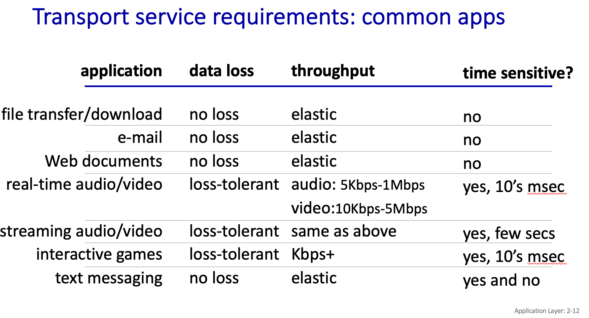
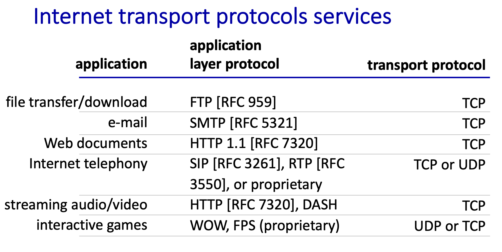

# 应用层

网页，APP，email，信息首发，YouTube，skype 等都是应用

应用通过应用层协议来通信。

## 应用层协议

每个应用层协议都是为了解决某一应用问题，所有的我们之前的学习的都是通信协议，如 HTTP，IMAP，FTP 等。

应用层的具体内容就是规定应用进程在通信时所**遵循的协议**。

### 客户/服务器(C/S, Client/Server)

这个好理解，就是我们目前的 web，app 等运行方式
Client 之间不能直接链接，
Client 链接 Server，
可能是间歇性 intermittently 链接，不是一直链接的

### 浏览器/服务器(B/S，Browser/Server)

这个就是单纯的网页，与上面类似，有以下特点：

- 界面统一，使用简单。客户端只需要安装浏览器软件
- 易于维护。对应用系统升级时，只需更新服务器端的软件，减轻了系统维护和升级的成本
- 可扩展性好。采用标准的 TCP/IP 和 HTTP 协议，具有良好的扩展性
- 信息共享度高。HTML 是数据格式的一个开放标准，目前大多数流行的软件均支持 HTML

### 对等(P2P，Peer to Peer)

就是 torrent 使用的技术，对等方式是指两个进程在通信时并不区分服务的请求方和服务的提供方。
他不存在一个用户-服务器概念，
终端与终端之间可以任意链接

- 只要两个主机都运行 P2P 软件，它们就可以进行平等、对等的通信

## 进程通信 Processes communicating

进程：是指计算机中已执行的程序
在同一主机内，两个进程使用进程间通信  inter-process communication （由操作系统定义）进行通信。在不同主机上的进程通过交换消息 exchanging messages 进行通信。

进程的通信方式就是 `Sockets - 套接字`

### 套接字 Sockets

socket 的原意是“插座”，在计算机通信领域，socket 被翻译为“套接字”，它是计算机之间进行通信的一种约定或一种方式。

通过 Socket 来发送，应用将数据传输给 Socket，然后 Socket 传输给传输层

通过 socket 这种约定，一台计算机可以接收其他计算机的数据，也可以向其他计算机发送数据。

知乎还有 [python 创建 Socket 相关知识](https://zhuanlan.zhihu.com/p/230800627)，先放在这里等待之后使用。

还有另一个笔记，来说明[接套字的流程](https://www.cnblogs.com/ggzhangxiaochao/p/15095179.html)

### IP 地址

通过 IP 地址来通信，一个完全的 IP 地址包括 IP 和端口 port
这个不需要过多赘述，自己非常了解了

### 协议 protocol

一个协议一般定义/规定了各种信息，方便用来通信与交换。

- 消息交换的类型: 例如请求、响应。
- 消息的语法: 消息中的字段以及字段如何分隔。
- 消息的语义: 字段中信息的含义。
- 规则: 进程何时以及如何发送和响应消息的规则。

其中有各种开放协议，和私有协议

#### 开放协议：

由 RFCs 定义，所有人都可以访问协议定义
允许互操作性
例如，HTTP、SMTP

#### 私有协议：

例如，Zoom、MS Teams

## APP 需要的传输服务

APP 等服务等运输，根据不同的应用，会使用不同的

### 数据完整性 data integrity

一些应用程序（例如文件传输、网络事务）需要 100%可靠的数据传输。

其他应用程序（例如音频）可以容忍一些丢失。

### 时效性，低延迟 Timing

某些应用程序（例如互联网电话、交互式游戏）需要低延迟才能“有效”

### 吞吐量 Throughput

吞吐量是一个关键指标，显示软件应用程序在特定时间（秒、分钟或小时）内可以处理的请求数量。

一些应用程序（例如多媒体）需要最低的吞吐量才能“有效”。其他应用程序（“弹性应用程序”）利用它们获得的任何吞吐量

### 常见 APP 需求

  
点击查看常见需求(图片)

  

    
  

## 网络通信传输协议

主要有两个，TCP，UDP
全面的知识可以[参考这篇](https://juejin.cn/post/7078847853694566408)

### UDP

UDP 的全称是用户数据报协议，在网络中它与 TCP 协议一样用于处理数据包，是一种无连接的协议。

在 OSI 模型中，在传输层，处于 IP 协议的上一层。UDP 有不提供数据包分组、组装和不能对数据包进行排序的缺点，也就是说，当报文发送之后，是无法得知其是否安全完整到达的。

- UDP 是无连接的，减少开销和发送数据之前的时延。
- UDP 使用最大努力交付，即不保证可靠交付。
- UDP 是面向报文的，适合一次性传输少量数据的网络应用。
- UDP 无拥塞控制，适合很多实时应用。
- UDP 首部开销小，8B，TCP 有 20B。

### TCP

TCP (Transmission Control Protocol) 传输控制协议, 是一种面向连接的、可靠的、基于字节流的传输层通信协议。TCP 是面向连接的、可靠的流协议（流就是指不间断的数据结构）。

- 在发送和接收进程之间提供可靠的传输 reliable transport.
- 流量控制 flow control：发送方不会使接收方不堪重负（overwhelm ）
- 拥塞控制 congestion control：在网络超载时限制 throttle 发送方
- 不提供：时序、最低吞吐量保证、安全性
- 面向连接：需要在客户端和服务器进程之间建立连接
- 每一条 TCP 连接只能有两个端点，每一条 TCP 连接只能是点对点的

### 例题

:::note 例题 1
List the four broad classes of services that a transport protocol can provide. For each of the service classes, indicate if either UDP or TCP (or both) provides such a service.
**传输协议**可以提供的四个广泛服务类别，以及 TCP 和 UDP 是否提供这些服务。

1. **可靠数据传输 Reliable data transfer**：

   - **描述**：确保数据在发送和接收之间可靠地传输，防止丢失、重复或乱序。
   - **TCP 提供**：TCP（传输控制协议）提供可靠的数据传输，通过确认和重传机制来确保数据的完整性和顺序。

2. **吞吐量保证** A guarantee that a certain value for throughput will be maintained：

   - **描述**：保证网络的吞吐量（数据传输速率）不低于某个特定值。
   - **TCP 和 UDP 都不提供**：TCP 和 UDP 都不直接提供吞吐量保证。

3. **数据传输时间保证** A guarantee that data will be delivered within a specified amount of time：

   - **描述**：确保数据在指定的时间内被传送到目的地。
   - **TCP 和 UDP 都不提供**：TCP 和 UDP 都不直接提供数据传输时间保证。

4. **安全性** Confidentiality (via encryption)：
   - **描述**：保护数据免受未经授权的访问、篡改或窃听。
   - **TCP 和 UDP 都不提供**：TCP 和 UDP 都不直接提供安全性。

总结：

- **TCP** 提供可靠数据传输，但不提供吞吐量保证、数据传输时间保证或安全性。
- **UDP** 是一种非连接性传输协议，不提供可靠数据传输，但适用于速度和数据大小优先于安全性和可靠性的应用场景

:::

### 常见 APP 使用的协议

  
点击查看常见APP协议(图片)

  

    
  

