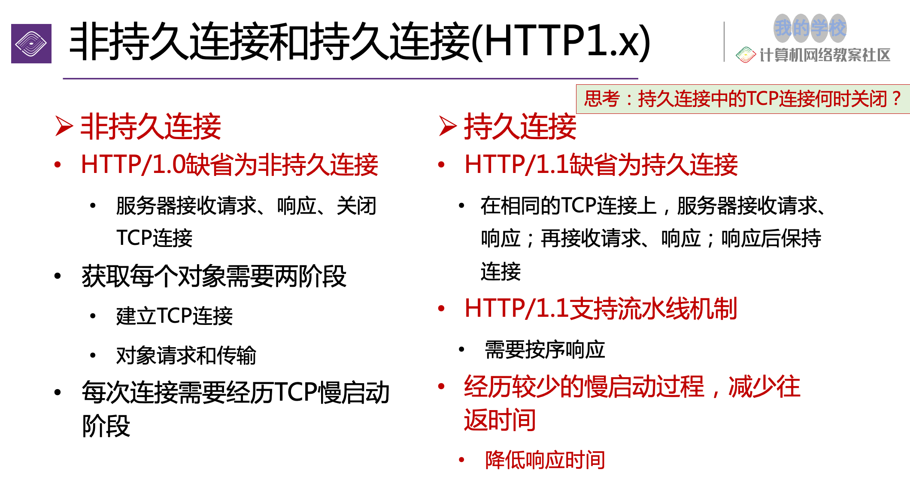
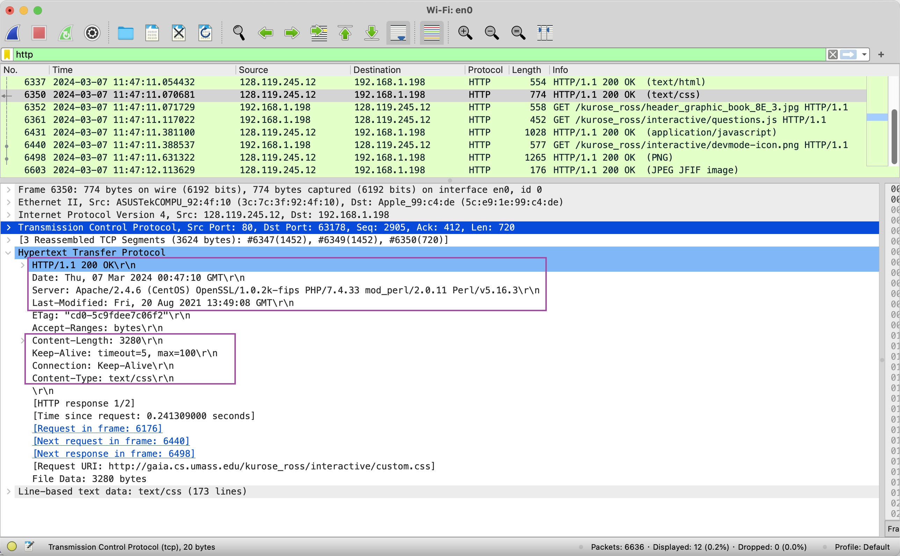

# Web 与 HTTP

了解一些关于 web 与 HTTP 的底层基础知识

## Web 基础

- Website 就是一个 object，保存在不同的 web server 上
- 他可以包括不同的资源，图片，音频等
- 网页包含了 HTML 文件，里面包含着多个不同的资源路径，每个都存在 URL 中

## HTTP 基础

- HTTP 是一个协议，规定了 server 和 client 之间的规则
- Client 会向 server 发送请求，
- Server 接受请求，并响应数据。

### HTTP 使用 TCP/IP 协议

他们的链接过程大概如下：

- 客户端到服务器端口（80 或自定义）
- 服务器接受 TCP 连接初始化 init（从客户端创建套接字 TCP 连接）
- 浏览器（HTTP 客户端）和 Web 服务器（HTTP 服务器）之间交换 HTTP 消息（应用层协议消息）
- TCP 连接关闭

### HTTP 特点

HTTP 为无状态协议，服务器端不保留之前请求的状态信息

- 无状态协议：效率低、但简单
- 有状态协议：维护状态相对复杂，需要维护历史信息，在客户端或服务器出现故障时，需要保持状态的一致性等
  - 维护“State”的协议是复杂的！必须维护过去的历史（状态）。
  - 如果服务器/客户端崩溃，则它们对“State”的视图可能不一致，必须进行同步协调。

## HTTP 链接

HTTP 链接分为两种，**持久链接**(`Persistent HTTP`)和 **非持久链接** (`Non-persistent HTTP`)

:::tip
总的来说，持久链接就是建立链接后，后续的请求不需要再初始化。

而非持久链接，则是每次请求都要初始化响应。(类似每次请求资源，数据等都需要先验证)
:::

:::info
HTTP 1.1 就是持久链接，而 HTTP 1.0 是非持久链接
:::

### 持久链接(Default)

多个对象可以通过单个 TCP 连接在客户端和服务器之间发送

### 非持久链接

- 最多只能在 TCP 连接上发送一个对象
- TCP 连接关闭
- 下载多个对象需要多个连接

### 对比

  
点击查看两种链接对比(图片)

  

    
  

## 链接建立&计算

转移到[单独笔记中](./fun2_3_Trans-Time)

## HTTP 信息

HTTP 表头中的 Date 是请求的时间。

HTTP 表头中如果有 keep-alive 就是一个持久链接。

请求中，可以看到请求类型，如 GET，POST，还有协议版本，如 HTTP 1.1。还有浏览器类型，为了知道是否可以运行 JS 代码。

Content length：告诉你内容的大小，单位为 **bytes**

还有很多暂时不说了。后面如果遇到需要的时候我在补充。

### wireshark 例子

  
点击查看wireshark捕获http请求例子

  

    
  

