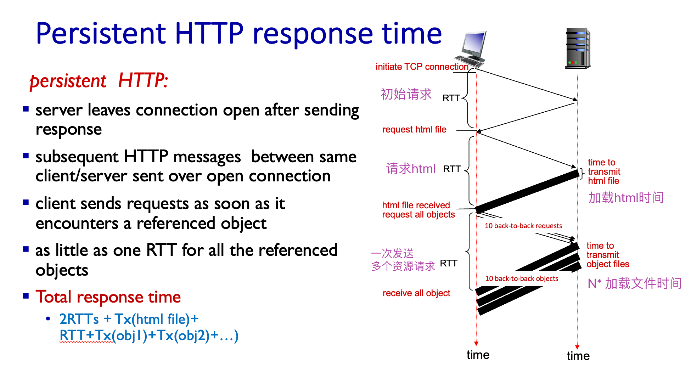
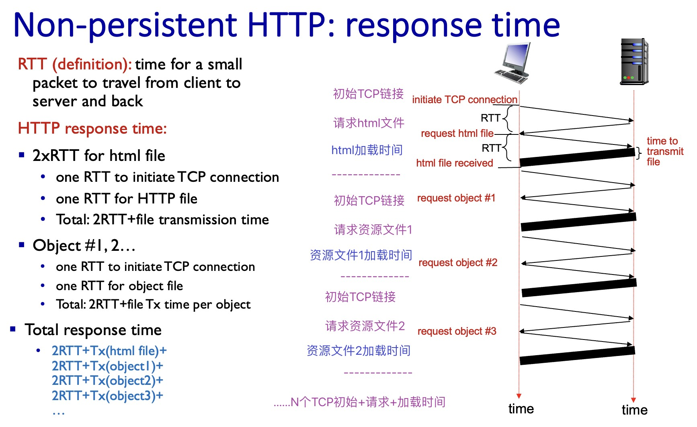
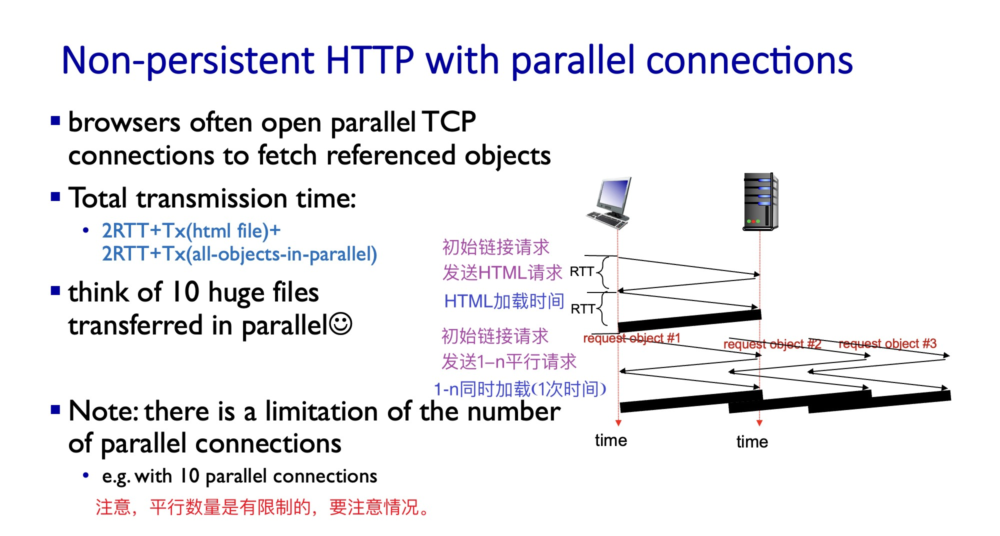
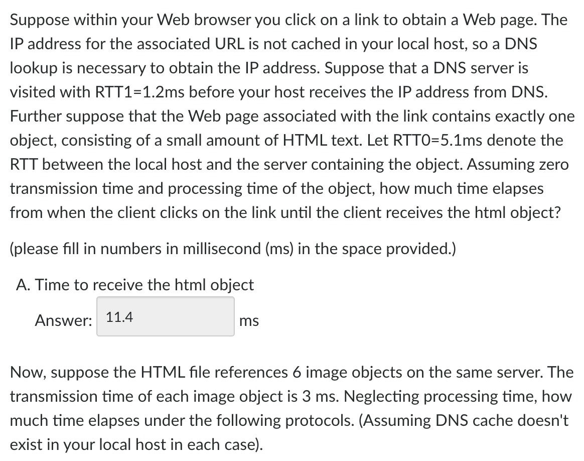
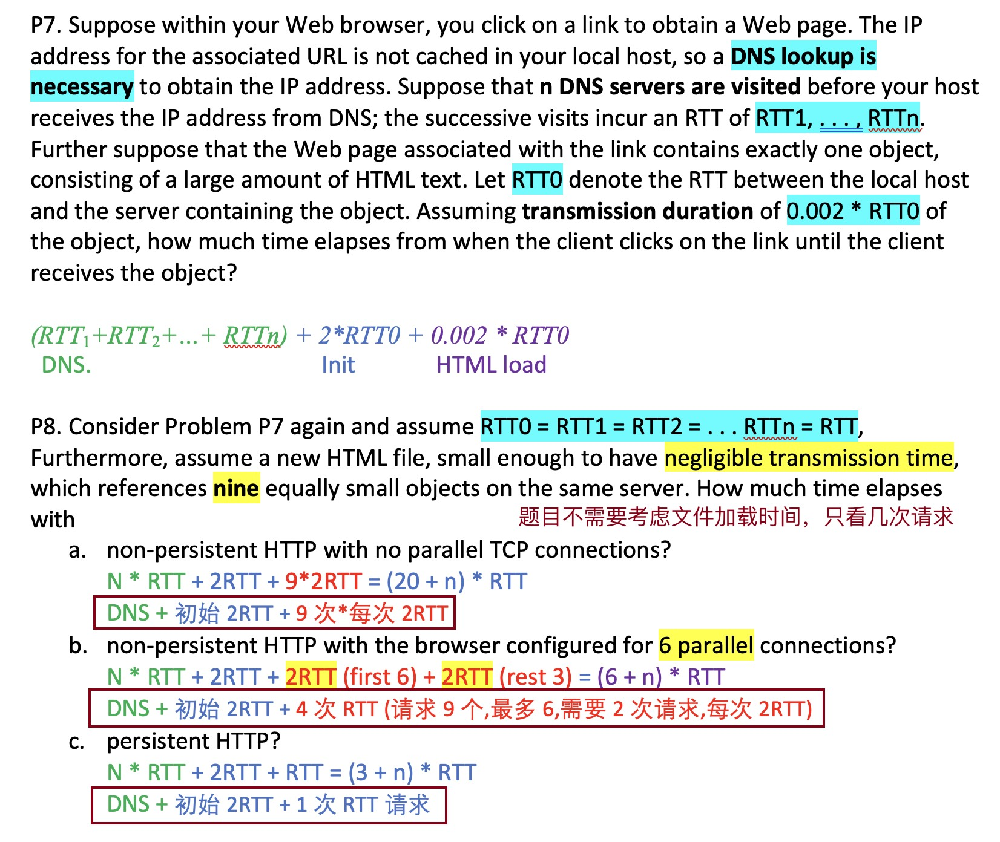

# 链接时间计算

两种链接的建立过程与计算。

## 持久链接（Default）

- 1 三次握手建立连接:确保连接建立的可靠性。
- 2 端口号:通过端口号标识上层协议和服务，实现了网络通道的多路复用。
- 3 完整性校验:通过对协议和载荷数据计算 **校验和**(`Checksum`)，保证了接收方能检测出传输过程中可能出现的差错。
- 4 确认机制:对于正确接收到的数据，接收方通过显式应答通告发送方，超出一定时间之后，发送方将重传没有被确认的段，确保传输的可靠性。
- 5 序列号:发送的所有数据都拥有唯一的序列号，这样不但唯一标识了每一个段(segment)，而且明确了每个段在整个数据流中的位置，接收方可以利用这些信息实现确认、丢失检测、乱序重排等功能。
- 6 窗口机制:通过可调节的窗口，TCP 接收方可以通告期望的发送速度，从而控制数据的流量。

### 校验图解

  
点击查看持久链接响应(图解)

  

    
  

:::note 使用餐厅点单类比持久链接

- 您好服务员(RTT)
- 请给我菜单(RTT)
  - 等待菜单时间
- 请给我汉堡，可乐，薯条(RTT)
  - 等待汉堡时间
  - 等待可乐时间
  - 等待薯条时间

:::

### 响应速度

:::info
`2RTT + T[HTML] + RTT + T[obj1] + T[obj2] + …`

- 2 次握手 + HTML + 1 次请求 + obj1 时间 + obj2 时间 ....

:::

## 非持久链接(无平行)

非持久链接每次请求都需要额外的牵手过程。

### 校验图解

  
点击查看非持久链接响应(图解)

  

    
  

:::note 使用餐厅点单类比非持久链接(无平行)

- 您好服务员(RTT)
- 请给我菜单(RTT)
  - 等待菜单时间
- 您好服务员(RTT)
- 请给我汉堡(RTT)
  - 等待汉堡时间
- 您好服务员(RTT)
- 请给我可乐(RTT)
  - 等待可乐时间
- 您好服务员(RTT)
- 请给我薯条(RTT)
  - 等待薯条时间

:::

### 非持久计算(无平行)

:::info
`2RTT + T[HTML] + 2RTT + T[obj1] + 2RTT + T[obj2] + ...`

- N 个 2RTT 时间
  - N \* [ (初始化 TCP 时间) + (发送资源请求的时间) ]
- N 个加载文件的时间
  - N \* (加载文件的时间，包括 html 文件，资源 1，资源 2...)

可以简化为：

- `2RTT + T[HTML] + N * ( 2RTT + T[obj] )`
- 2 次握手 + HTML + N 个数据 \* (每个 2 次握手 + 每个加载时间)

:::

## 非持久链接(平行)

非持久链接平行最多有 N 个，具体几个要看实际情况

### 校验图解

  
点击查看非持久链接[平行]响应(图解)

  

    
  

:::note 使用餐厅点单类比非持久链接(10 平行)

- 您好服务员(RTT)
- 请给我菜单(RTT)
  - 等待菜单时间
- 您好服务员(RTT)
- 请给我汉堡可乐薯条(RTT)
  - 等待(汉堡可乐薯条)时间(同时上的)

:::

### 非持久平行计算

:::info
`2RTT + T[HTML]+ 2RTT + T[all-objects-in-parallel]`

- 2 次初始 + HTML + 2 次初始 + T \[Obj1-10\](取 1 个的加载时间)

:::

## 例题

### 题目 1

#### A. 有 1.2ms 的 DNS 查询时间(not cached)，RTT0 为 5.1ms。HTML 假设为 0，点击链接后多久获取 HTML？

:::info

解析：DNS 查询时间 + 2 次初始 RTT + HTML 加载时间

- 5.1ms \* 2 + 1.2 = 11.4 ms
- DNS + 2RTTs + T[HTML]

:::

#### 题目补充

:::note 题目 1 补充
**HTML 文件会从同一个 server 请求 6 个图片，每个图片传输时间为 3ms，计算下列时间**

**[假设 DNS 不 cache， 每次都需要加上 DNS 时间]**
:::

#### B. 持久链接的时间？

:::info
解析：需要 A 结果 + 1 次 RTT + 6 个 Obj 加载时间。

- A（点击到获取 HTML 时间） + 5.1ms + 6 \* 3ms = 34.5ms
- A + RTT + 6 \* T[obj]

:::

#### C.非持久链接（无 parallel TCP）

:::info
解析：我们请求了 6 个 obj，需要 A 结果 + 请求 6 次握手 2RTT + 6 个 Obj 加载时间。

- A（点击到获取 HTML 时间） + 6 \* (2 \* 5.1ms) + 6 \* 3ms = 90.6ms
- A + 6 \* （2RTTs ） + 6 \* T[Obj]
- A + 6 \* ( 2RTTs + T[obj] )
  :::

#### D.非持久链接（有至多 10parallel）

:::info
解析：我们请求了 6 个 obj，而最多平行 10 个，6 个文件可以只请求一次，加载也只需要一次时间。

- A + (2 \* 5.1ms) + 3ms = 24.6ms
- A 结果 + 2RTT + T[Obj-all-in-1]

:::

### 题目 2

