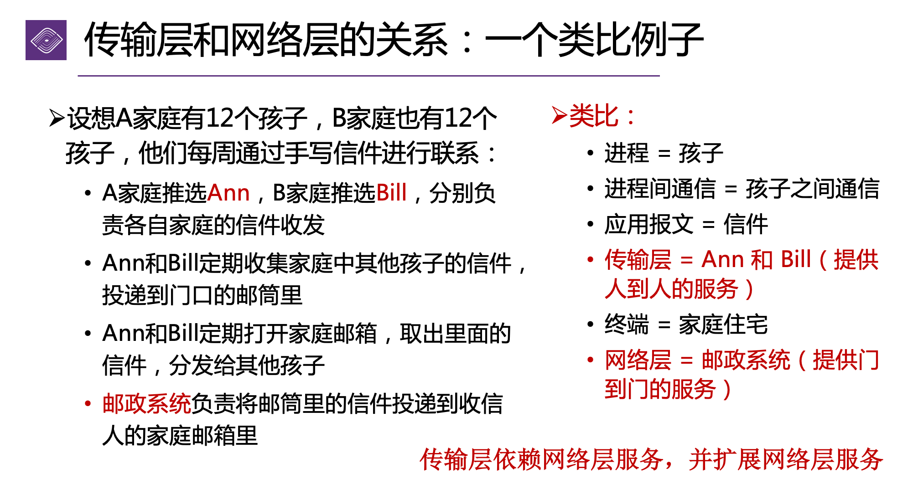
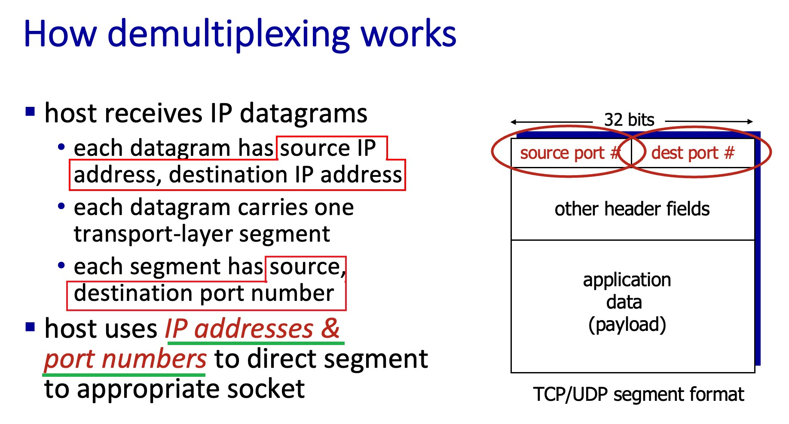
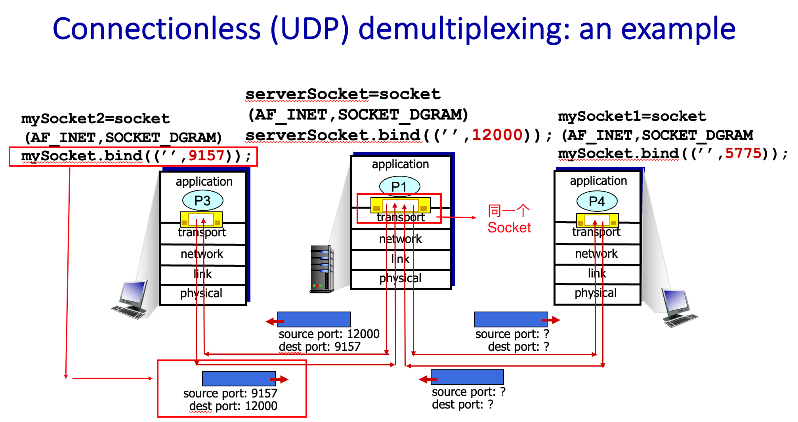
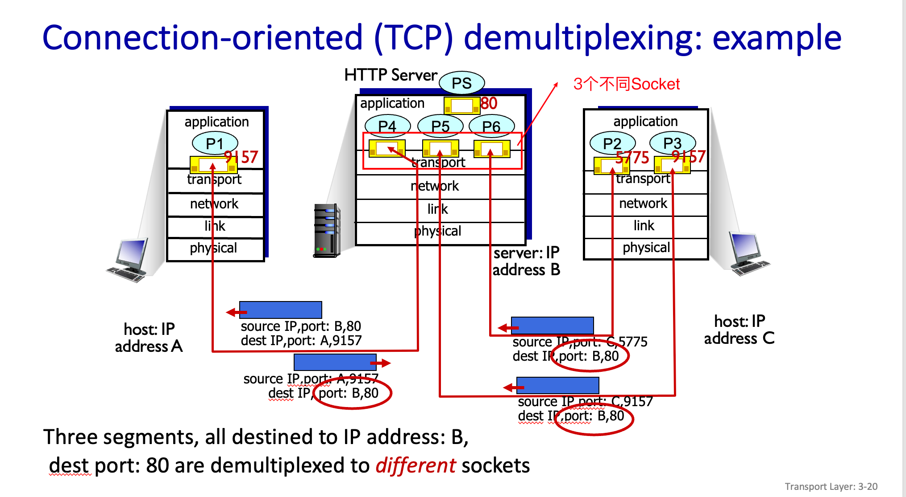
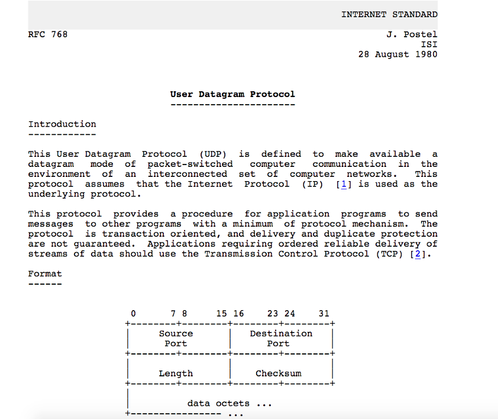
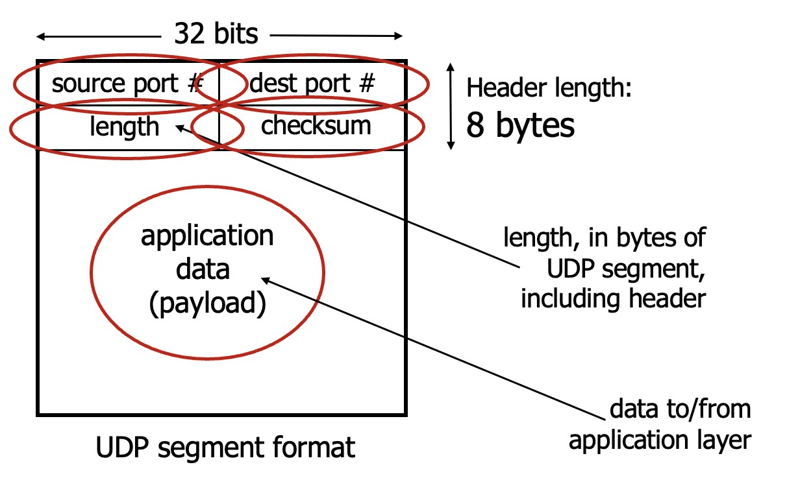
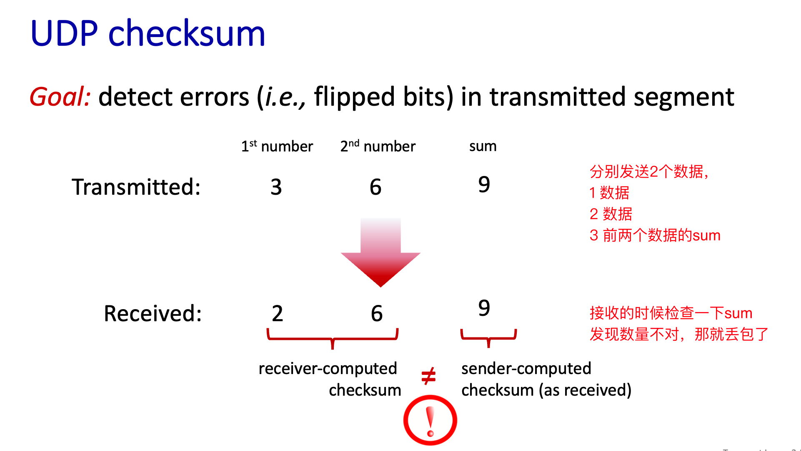
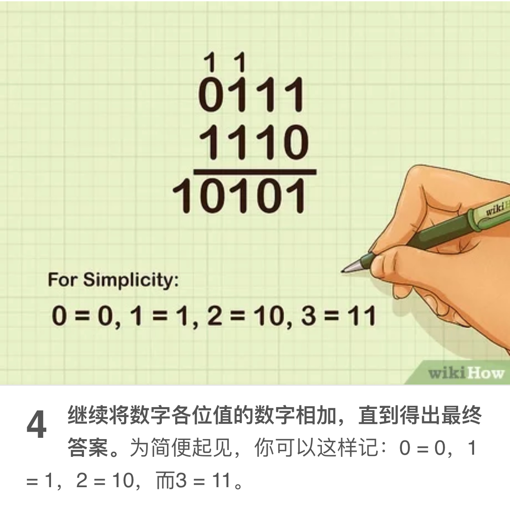

# 传输层 Transport Layer

当应用在不同终端使用的时候，传输层提供了逻辑交流 Logical communication

传输层协议做了什么：

- Sender 方
  - 处理应用层发出的数据
  - 将数据 breaks into small segments (分段数据)
  - 给 segments 添加 header
  - 将 segments 传输到网络层
- Receiver 方
  - 从网络层接收 segments
  - 检查 segments 的 header
  - 重新组装 reassembly 数据
  - 将数据传输到应用层

传输层主要有两个 Protocol： `UDP`，`TCP`

:::tip

什么时候用 TCP？不想数据有问题，并且对时间不敏感。

什么时候用 UDP？ 数据部分丢失也没事，并且对时间敏感。（如直播，网络电话，需要实时的，但丢失一点数据，比如视频/声音卡了，也没关系）
:::

## 传输层概述

设想在应用程序和网络之间存在一扇“门”，发送进程将报文推到门外。门外的运输设施（因特网）将报文送到接收进程的门口。接收进程打开门，即可收到报文。

在 TCP/IP 网络中，这扇“门”称为套接字（socket），是应用层和传输层的接口，也是应用程序和网络之间的 API。

  
传输层和网络层的关系类比

  

    
  

传输层的有所为、有所不为:

传输层可以通过**差错恢复**、**重排序**等手段提供可靠 reliable、按序的交付服务 in-order delivery。

要注意的是，传输层无法提供 `delay guarantees 延迟保证`与 `bandwidth guarantees 带宽保证`。

## Socket 套接字

有关 Socket 编程的部分，单独写在了[这篇笔记中](./fun3_2_socket_programming)

Socket 会自动分配 port

## Multiplexing 复用 与 Demultiplexing 分用

Multiplexing 复用：
处理从多个 sockets 来的数据，并且添加 transport header，传递到网络层。

Demultiplexing 分用：
将从网络层收到的数据，根据 header info 传递给正确的 socket

:::info
也就是添加 header，与读取 header 的步骤。也就是传输层的重要一环。

(类比的话 Multiplexing 就像给信写地址并投递到邮筒，Demultiplexing 就像邮递员根据门牌号把信放入邮箱)
:::

  
分用的原理和header结构

  

    
  

### UDP Demultiplexing

- 当创建数据包传输到 UDP socket 的时候，必须声明**目标 IP** 和**目标 port**
- 当接收端收到 USP 分段数据的时候，会检查 segment 中的目标 port，并且将 UDP segment 发送到正确的 port
- IP/UDP 数据包具有相同的目标 port，但不同的源 IP 地址和/或源 port 将被指向接收方的同一个 socket。（只要去往同一个 IP，port，不管从哪里来的，都会到同一个 socket）

:::info 总结
UDP Socket 使用两个数据来进行识别：dest 目标 IP 和 dest 目标 Port。

并且只要去往同一个 dest IP 和 dest port，不管从哪里来的，都会到同一个 socket。
:::

### TCP Demultiplexing

TCP 的辨认方法与 UDP 不同，TCP socket 会辨认 4 个部分：

- 来源 IP
- 来源 port
- 目标 IP
- 目标 port

Demultiplexing：必须收到**所有的 4 个数据**，(源 IP ，目的 IP ，源 port，目的 port) 四元组进行标识，才会将 segment 传递到正确的 socket。

:::note
一个服务器可以同时拥有多个 TCP socket：

- 每个 socket 由自己的 4 个数据识别
- 每个 socket 与不同的连接客户端相关联

:::

:::tip 注意
就算同一个终端，同一个来源 IP，目标 IP 和 port 都一样，但是发出请求的时候 port 不同，这个 TCP 传输就会通过 2 个不同的 Socket。
:::

### 总结

:::info summary

- 这两个都是基于 segment/datagram 数据上 header 中的 value 来处理。
- USP：Demultiplexing 只需要目标 IP 和 port，且同一个目标 port 使用一个 socket。
- TCP：Demultiplexing 需要 4 个数据，来源 IP 和 Port，目标 IP 和 Port。支持多个 socket。
  :::

## UDP

User Datagram Protocol，即用户数据协议。

### UDP 特点

**UDP 提供的服务**

- 尽最大努力将数据包交付到目的主机 best effort service
- 不保证投递的可靠性和顺序(有可能丢失，也可能乱序)
- 不保证带宽及延迟要求
- 进程到进程之间的报文交付
- 报文完整性检查（可选）：检测并丢弃出错的报文

**UDP 需要实现的功能**

- 复用和分用
- 报文检错

**UDP 无连接**

- UDP 发送方和接收方之间**没有握手**
- 每个 UDP 分段独立处理，与其他分段无关

:::tip 优点

- 无建立连接的延迟(无 RTT)
- 简单：发送方和接收方没有连接状态
- header 小
- 没有阻塞控制
  - 应用可以通过 UDP 尽可能快速地发送数据
  - 不限制发送速率（不进行拥塞控制和流量控制）

:::

所以我们可以将 UDP 应用在：

- 流媒体应用程序（对丢包宽容，对速率敏感）
- DNS
- SNMP
- HTTP/3

当然，如果你一定要在 UDP 上进行可靠传输（例如，HTTP/3），也不是没有办法的：

- 在应用层添加所需的可靠性 reliability
- 在应用层添加拥塞控制 congestion control

  
UDP简介与格式

  

    
    
  

### 校验和 Checksum

UDP 使用**校验和 Checksum**来检测传输 segment 途中的错误，比如丢失的数据。(因为 UDP 容易丢失数据)

**Sender**：

- 将 UDP segment 的内容(包括 UDP header 和 IP)视为 16bit 整数序列
- 校验和：求和（按位取反和）
- 将结果值放入 UDP checksum field

**Receiver**：

- 计算接收到的数据 sum
- 检查算出的 sum 是否和 checksum field 值相同

  - 不相等 - 检测到错误
  - 相等 - 未检测到错误
  - 但可能仍然存在错误？之后详细讨论...

#### 校验和计算

校验和计算是将数据都看成是由 16 bit 整数组成的序列。

计算方法没有我想的那么复杂，但是还有一些奇怪的规则。

:::info 二进制基础计算
将两排数字相加，`0 + 0 = 0`, `0 + 1 = 1`, `1 + 1 = 10`(取 0 进 1), `1 + 1 + 1 = 11`(取 1 进 1)

:::

:::warning 校验和计算
**相加后将 1 和 0 反转，就得到了校验和 Checksum**

例如，两行相加得到 1001，校验和就是 0110.
:::

:::info wrap-around
当我们的位数溢出 overflow 的时候(即最前面进了 1 位)，我们需要将最前面的位再加回最后面。这个行为就叫做 wrap-around。

这里一会找个例子
:::

### UDP 在传输层的行为

**UDP 发送方**

- 处理应用层发出的数据
- 将数据 breaks into small segments (分段数据)
- 给 UDP segments 添加 header
- 将 segments 传输到网络层

**UDP 接收方**

- 从网络层接收 segments
- 检查 **UDP checksum** (校验和)
- 重新组装 reassembly 数据
- 将数据传输到 Socket

### UDP 总结

:::info
简约的协议，segments 可能会丢失，乱序。尽最大努力发送数据(send and hope for the best)。

优点有无握手设置(快速，无 RTT)
:::

## TCP

TCP 全称 Transmission Control Protocol，即传输控制协议

Web 最多使用的协议之一。

:::info 特点

- 可靠 reliable，有序运送 in-order delivery
- 堵塞控制 congestion control
- 流控制 flow control
- connection setup

:::
