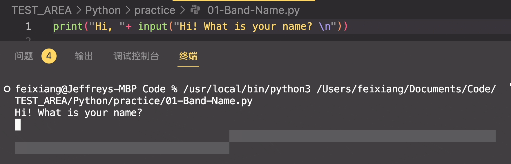

# 基础语法

放一些 Python 的基础语法

## Key words 关键字

保留字即关键字，我们不能把它们用作任何标识符名称。

Python 的标准库提供了一个 keyword 模块，可以输出当前版本的所有关键字：

```python
import keyword;
print(keyword.kwlist)
```

给我们打印了一个数组：
['False', 'None', 'True', 'and', 'as', 'assert', 'async', 'await', 'break', 'class', 'continue', 'def', 'del', 'elif', 'else', 'except', 'finally', 'for', 'from', 'global', 'if', 'import', 'in', 'is', 'lambda', 'nonlocal', 'not', 'or', 'pass', 'raise', 'return', 'try', 'while', 'with', 'yield']

## 注释

Python 注释自己使用了，是一个单 `#` 井号，还是老规矩 - `command + /`

多行注释可以用多个 # 号，还有 ''' 和 """

```python
# 第1注释

'''
第2注释
'''

"""
第3注释
"""
```

## 多行语句

Python 通常是一行写完一条语句，但如果语句很长，我们可以使用反斜杠 \ 来实现多行语句。(说实话，有点难看)

```python
item_one = 1
item_two = 2
item_three = 3

total = item_one + \
        item_two + \
        item_three

print(total)
# 6
```

## 打印与输入

### print

Python 的打印语法很简单，与 JS 的 `console.log()`，Java 的 `System.out.println()`不同，Python 的贼简单`print()`

```python title="Python朴实无华的打印"
print("Hi Jeff")
```

### input

Java 的输入是`System.console().readLine()`[Java 的输入看这里回顾](../../JAVA/Methods/usefulSytax)，JS 是创建/读取输入框的内容，Python 的 input 也是简单的

```python title="Python朴实无华的输入"
input("Hi, What is your name?")
```

### 例子

还记得之前的[Java 对话例子](../../JAVA/Methods/usefulSytax)吗？我们创建了一个对话程序，Java 的运行方式是：

- 将 System.console().readLine()输入的数据，赋值给变量如 name
- println 打印出 name。

但是 Python 似乎可以这样：

```python
print("Hello" + input("What is your name?"))
```

这样的运行结果和上面类似，没想到可以这样敲代码？



当然，也可以正常使用的变量储存的

```python
city = input("What is the city you born? \n")
pet = input("What is your pet's name? \n")

print("Your band name will be: " + city + " " + pet)
```

这样的结果就是正常的问答了。
