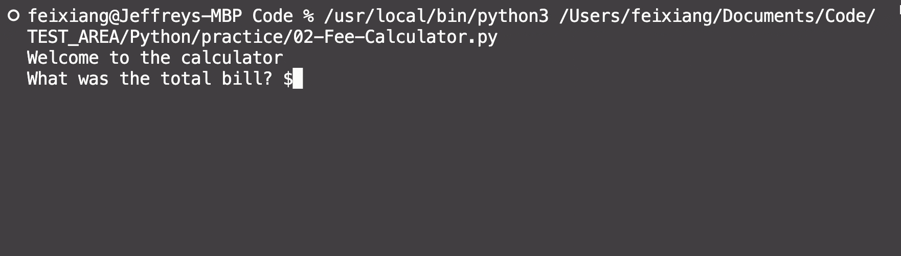

# 变量类型与转换

变量类型的概念不需要做多赘述了。

## 变量赋值

Python 中的变量赋值不需要类型声明。

等号 = 运算符左边是一个变量名，等号 = 运算符右边是存储在变量中的值。

```python
counter = 100 # 赋值整型变量
miles = 1000.0 # 浮点型
name = "John" # 字符串
```

### 多个变量赋值

Python 允许同时为多个变量赋值，既可以同时赋相同的值，也可以不同。

```python
a = b = c = 1

a, b, c = 1, 2, "john"
```

## 标准数据类型

- Number（数字，包括 Integer，Float）
- String（字符串）
- bool（布尔类型）
- List（列表-实际上就是 Array）
- Tuple（元组）
- Set（集合）
- Dictionary（字典-实际上就是 Object）

:::note
想要检查数据类型，使用 type(variable) 函数。
:::

### String

字符串目前没有看到与 JS 差别太大的地方，列举一些常用方法

#### len(String)

返回字符串的 length，与 Js 的不同，JS 是直接将字符串的 length 作为属性输出，如 Str.length

```python
len("String")
```

### Number

数字也没有看到太大的差别，Python 的大数字列举方式与 Java 类似，都是可以自动规避下划线。如 123_456_789 的数字打印出来不会存在下划线。

Float 也没有太大区别

#### round(float,roundTo)

返回四舍五入的数字

```python
round(2.6666)
# return 3
round(2.6666,2)
# return 2.67
```

### Boolean

布尔值使用方式也没有区别。

:::info 布尔值
要注意的是在 Python 中，布尔值需要首字母大写。

```python
flag = True
isLogin = False
```

:::

## 类型转换

在 python 中，有地方需要我们做类型转换。我们先看问题：

```ts title="TS"
const num: number = 7;
console.log("Hi Jeff, have you finished chapter " + num + "?");
```

```Java title="Java"
int num = 7;
System.out.println("Hi Jeff, have you finished chapter " + num + "?" )
```

这两个在 TS 和 Java 的运算中，不会出现问题，都会打印出同样的结果。

:::warning 但是 python 不可以

我们不能把数字直接拼接到字符串中。

```python title="Python"
num = 7
# error next line
print("Hi Jeff, have you finished chapter " + num + "?" )

# TypeError: can only concatenate str (not "int") to str
```

:::

于是为了解决问题，我们需要手动来更改类型，使用 `str()` 函数。

```python title="Python手动转换类型"
num = 7
# correct next line
numToStr = str(num)
print("Hi Jeff, have you finished chapter " + numToStr + "?" )
```

### 类型转换方法

| Syntax   | Description                                       |
| -------- | ------------------------------------------------- |
| int(x)   | 将 x 转换为一个整数                               |
| float(x) | 将 x 转换到一个浮点数                             |
| str(x)   | 将对象 x 转换为字符串                             |
| tuple(s) | 将序列 s 转换为一个元组                           |
| list(s)  | 将序列 s 转换为一个列表                           |
| set(s)   | 转换为可变集合                                    |
| dict(d)  | 创建一个字典。d 必须是一个 (key, value)元组序列。 |

### f-string

当然 Python 也有自己的 Template literals，不然每个数据都转换那不得累死？

它叫做`f-string`。f-string 格式化字符串以 f 开头，后面跟着字符串，字符串中的表达式用大括号 {} 包起来，它会将变量或表达式计算后的值替换进去

下面放一个练习案例。

```python title="f-string案例"
print("Welcome to the calculator")
price = float(input("What was the total bill? $"))

tipPercent = int(input("What percentage tip would you like to give? 10, 12, or 15? "))

numOfPeople = int(input("How many people are there to split the bill? "))

pricePerPerson = price * (1 + tipPercent * 0.01) / numOfPeople

print(f"You need to pay ${round(pricePerPerson,2)} dollars")
```


