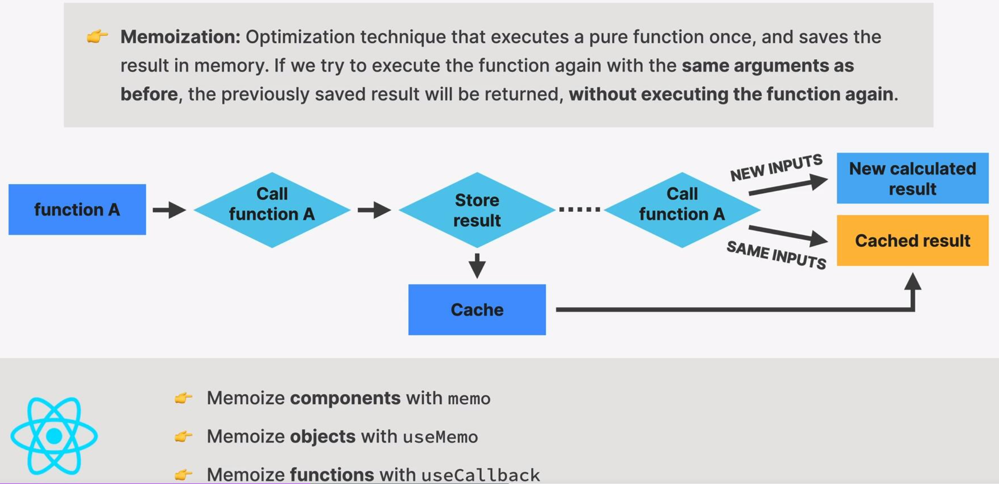
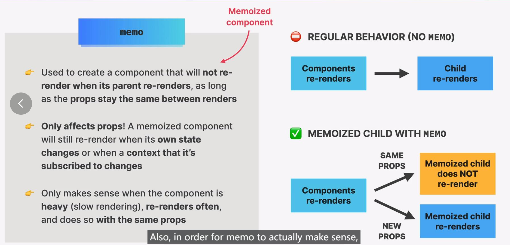

# Memo 缓存

主要为缓存一个组件，当我们需要使用的时候，可以直接从缓存中读取，而不是重新渲染一遍。

## memo 是什么

:::note
memoization n.  对函数返回值进行缓存(一种计算机程序优化技术)
:::

当我们调用 Pure 函数，计算机会将结果缓存起来。当下次使用一样的参数再调用该 Fn 时，可以直接从 cache 中提取出结果，而不需要再去调用函数。



## memo 组件特征

创建一个组件，当父组件重新渲染时，只要 props 相同，那么该组件就不会被重新渲染。
只会收到 props 影响，当 state 与 context 改变时，还是会改变。

只需要将重组件改变为 memo 组件，就是经常重新渲染的组件或者 prop 经常改变的组件。



## memo 如何使用

直接引入 memo，并且包裹一个**高消耗组件**，并赋值给一个同名变量即可。

:::warning 不需要 cache 全部
注意，我们不需要将所有的组件都缓存，只需要包裹一些高消耗组件，防止他因为状态切换的时候反复渲染。
:::

:::note 语法

```js
const MemoizedComponent = memo(SomeComponent, arePropsEqual?)
```

:::

例子一览：

```js title="HeavyComponent.jsx"
import { memo } from "react";

const Archive = memo(function Archive({ archiveOptions, onAddPost }) {
  // ...
});
```

此时，SomeComponent 将会缓存在 cache 中，方便随时调出使用。

## 参数为 Object，导致缓存失效。

我们之前说过，memo 是当下次使用`一样的参数`再调用该 Pure Fn 时，才会生效的手段。

:::warning memo 失效
如果我们在参数中传入一个`Object`，obj 因为重新渲染，会重新创建， 那么`参数会与之前不同`，于是 memo 会失效。
:::

```js title="App.js"
// error-start
const archiveOptions = {
  return {
    show: false,
    title: `Post archive in addition to ${posts.length} main posts`,
  };
};
// error-end

<Archive
  //highlight-next-line
  archiveOptions={archiveOptions}
  setIsFakeDark={setIsFakeDark}
/>
```

为了解决这个问题，我们就需要用到 useMemo Hook。
