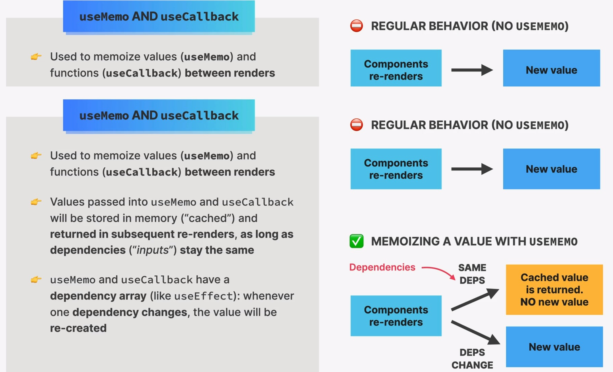

# useMemo Hook

上次我们说到，因为使用了 Object 作为参数，会导致 memo 组件失效，为了解决这个问题，我们应该使用 useMemo 钩子。

我们使用 useMemo 缓存值，这样值(`该参数`)的部分没有改变，那么也不会重新渲染了。

如果 dependencies 不变，那么函数/组件会直接从缓存 return; 如果改变了，则会重新生成。



## 主要应用场景

- 缓存 props 来防止浪费渲染。
- 缓存 values 来防止每次渲染的大量重新计算。
- 缓存一些供其他 hook 使用的依赖 value，如防止 useEffect 无限循环。

## 使用方法

使用 useMemo 包裹参数/值，传入依赖项，这样会缓存一些

:::note 语法

```js
const cachedValue = useMemo(calculateValue, dependencies);
```

需要接受一个值(或 Fn 函数计算返回值)，与一个依赖项 Dependency Array。

如果依赖项为空，说明只需要初始化的时候执行一次。使用与 useEffect 相同
:::

```js
import { memo, useMemo } from "react";

// correct-start
const archiveOptions = useMemo(() => {
  return {
    show: false,
    title: `Post archive in addition to ${posts.length} main posts`,
  };
}, [posts.length]);
// correct-end

<Archive
  //highlight-next-line
  archiveOptions={archiveOptions}
  setIsFakeDark={setIsFakeDark}
/>;
```

此时这样使用就解决了之前的因为参数改变重新渲染问题。

## 参数为 Function，导致缓存失效。

但是当我们传入一个 Fn 函数的时候，这个问题又出现了。

```js title="App.js"
// error-start
function handleAddPost(post) {
  setPosts((posts) => [post, ...posts]);
}
// error-end

const archiveOptions = useMemo(() => {
  return {
    show: false,
    title: `Post archive in addition to ${posts.length} main posts`,
  };
}, [posts.length]);

<Archive
  archiveOptions={archiveOptions}
  //error next line
  onAddPost={handleAddPost}
  setIsFakeDark={setIsFakeDark}
/>;
```

:::warning
原理与刚刚是一样的，因为外部**父组件重新渲染**，此时传入 props 的 Function 也改变了（虽然看起来没变，但是已经不是同一个 obj 了），需要重新渲染 Archive 组件。

此时我们就需要 `useCallback` 钩子来解决了，即缓存函数。
:::
