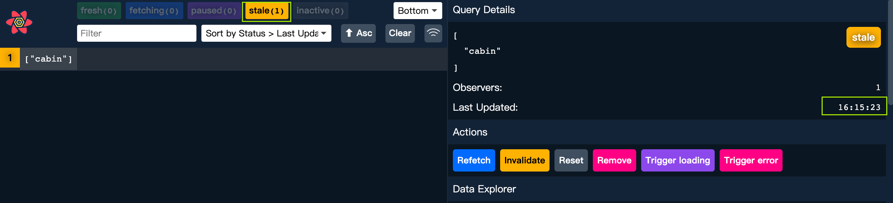

# QueryClient 初始化

在使用之前，我们需要初始化 react query。就像是路由的配置一样，我们也需要创建，配置 QueryClient。

## QueryClient

### 初始化 Query Client 并传入配置

```jsx title="App.jsx"
import { QueryClient, QueryClientProvider } from "@tanstack/react-query";

const queryClient = new QueryClient({
  defaultOptions: {
    queries: {
      // staleTime: 60 * 1000,
      staleTime: 0,
    },
  },
});
```

:::note

- staleTime 就是设置一个时间内，缓存中的数据有效。

  - 比如这里设置 1 分钟，表示获取数据后的 1 分钟内，我们认为数据是 fresh 的。
  - 这个时间根据业务需求来更改，可能某些数据想要保持 10s，我们就设置为 10s

- 如果数据此时是 fresh，其他组件如果发送相同的 query，也不会 fetch 而是直接使用缓存中的 fresh 数据。
  - 而 1 分钟之后，该数据会标记为 stale，一旦切出页面，或者重新进入组件，都会刷新数据。

:::

### QueryClientProvider 包裹根组件

被包裹组件内的 query 都会经过这个 QueryClient 处理
(有点像 redux 的传递方式)

```jsx
function App() {
  return (
    <DarkModeProvider>
      // correct next line
      <QueryClientProvider client={queryClient}>
        <ReactQueryDevtools initialIsOpen={false} />

        <GlobalStyles></GlobalStyles>
        <BrowserRouter>
          <Routes>...</Routes>
        </BrowserRouter>

        <Toaster />
      </QueryClientProvider>
    </DarkModeProvider>
  );
}
```

## ReactQueryDevtools

是 ReactQuery 中的开发组件，我们可以设置默认关闭界面。

这个开发组件只有开发模式会出现，所以忘记祛除也没关系。

我们需要引入 ReactQueryDevtools 组件并使用。

```jsx
import { ReactQueryDevtools } from "@tanstack/react-query-devtools";

<ReactQueryDevtools initialIsOpen={false} />;
```

### 使用情况一览

在 Devtools 中，我们可以看到缓存中的数据，与数据的状态。

Fresh 的数据即为当下最新的数据，会直接读取。


Fresh 数据不会刷新，如果数据被标记为 stale，切换 tab 之后就会刷新。

**所以设置过期时间决定了给后端发送数据的速率。**


