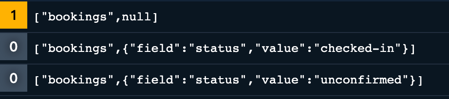

# useQuery 获取数据

React Query 通常使用 useQuery 钩子来获取数据。

可以直接使用，也可以制作自定义钩子返回数据。（自己之前使用了自定义钩子）

我们先通过直接使用，来了解基础概念。

## 直接使用

查询是一种对于与`唯一键值`相关联的异步数据源的声明性依赖。

查询可以与**任何基于 Promise 的方法**（包括 GET 和 POST 方法）一起使用，以从服务器获取数据。

如果你的方法修改了服务器上的数据，应该使用[修改 Mutation](./useMutation)

:::note Syntax

要在你的组件或自定义 Hook 中订阅一个查询，至少需要以下的参数来调用 useQueryHook：

```jsx
const info = useQuery({ queryKey: ["keys"], queryFn: fetchFunction });
```

- queryKey
  - 该查询的一个**唯一的键值**
- queryFn: 一个返回 Promise 的函数
  - 解析数据，或
  - 抛出错误

**更详细的参数笔记可以参考[本篇最下面的部分](./useQuery#参数特性)**
:::

```jsx
import { useQuery } from "react-query";

function App() {
  const info = useQuery({ queryKey: ["todos"], queryFn: fetchTodoList });
}
```

:::tip queryKey
这个唯一键值 `queryKey` 将在内部用于重新获取数据、缓存和在整个程序中共享该查询信息。

Query 是通过这个 key 来识别的，如果 key 一样，意味着请求的数据一样，那么他可以选择直接缓存读取，或者重新 fetch。
:::

### 返回数据

useQuery 返回的查询结果将包含所有关于该查询的信息，他真的非常好用，内部包括了很多方便的数据，来提高用户的体验。

```jsx
const result = useQuery({ queryKey: ["todos"], queryFn: fetchTodoList });
```

:::info 状态
result 对象包含一些非常重要的**状态**，你需要注意这些状态才能提高工作效率。 查询只能处于以下状态之一：

- isLoading 或者 status === 'loading' - 查询暂时还没有数据
- isError 或者 status === 'error' - 查询遇到一个错误
- isSuccess 或者 status === 'success' - 查询成功，并且数据可用
  :::

:::info 结果

- error - 如果查询处于 isError 状态，则可以通过 `error` 属性获取该错误
- data - 如果查询处于 isSuccess 状态，则可以通过 `data` 属性获得数据
  :::

```jsx title="例子"
function Todos() {
  // correct next line
  const { isLoading, isError, data, error } = useQuery({
    queryKey: ["todos"],
    queryFn: fetchTodoList,
  });

  if (isLoading) {
    return <span>Loading...</span>;
  }

  // 如果获取失败，提醒用户
  if (isError) {
    return <span>Error: {error.message}</span>;
  }

  // 现在数据获取成功了，我们可以渲染数据了
  return (
    <ul>
      {data.map((todo) => (
        <li key={todo.id}>{todo.title}</li>
      ))}
    </ul>
  );
}
```

## 自定义钩子

选取之前一个例子，二次包裹一下 useQuery 钩子。

```jsx title="useBooking.js"
// 引入useQuery钩子
import { useQuery } from "@tanstack/react-query";
// 引入fetch数据的异步函数
import { getBooking } from "../../services/apiBookings";
// 此处为router的钩子，获取url中的params
import { useParams } from "react-router-dom";

export function useBooking() {
  const { bookingId } = useParams();
  const {
    isLoading,
    data: booking,
    error,
  } = useQuery({
    // correct next line
    queryKey: ["booking", bookingId],
    queryFn: () => getBooking(bookingId),
    retry: false,
  });

  // 返回状态，错误，与数据
  return { isLoading, error, booking };
}
```

## 参数特性

### queryKey

刚刚例子也展示了 queryKey 的特性，Array 中不仅仅有 key，还有一些依赖。

queryKey 必须是一个数组类型，里面可以是**复杂数据**，也可以只是一个 string。

#### 参数 1 string 类型

这个 key 很重要，有点类似于 localStorage 的 name，
如果后续其他的 query 也是这个 queryKey，
那么规定时间内的请求就会被拦截
并且直接使用这个缓存中的数据

#### 参数 2 dependency

类似 useEffect 钩子的依赖项，但不同的依赖就是不同的数据，创建不同的数据组在 cache 中。

如：

- bookings，第 1 页的数据
- bookings，筛选后的数据



### queryFn

必须是一个异步函数，或者返回 promise
就是发送 query 的 fn，这里是正常的 fetch，await 之后 return 数据
