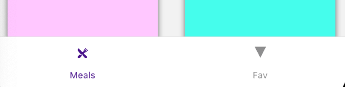

# 配置 Navigator

有多种不同的 Navigator，自己用过三种，先写这三种，之后用了其余的再做补充。

## Stack Navigator 堆栈导航

- 使用 createNativeStackNavigator 创建一个导航器

  - 如 const Stack = createNativeStackNavigator();

- 使用 Stack.Navigator 包裹 Stack.Screen。
- Stack.Screen 中类似 React 路由，包含`唯一 ID(路由地址)` 与`渲染 Component`。

:::note
集合页面可以规划好 title，style 等
单独页面的 header 可以设置在单个路由上，
也可以使用 navigation.setOptions 设置在该组件内部。
:::

```js title="StackNavigator"
// correct next line
import { createNativeStackNavigator } from "@react-navigation/native-stack";
import CategoriesScreen from "../screens/CategoriesScreen";
import CategoriesMealsScreen from "../screens/CategoriesMealsScreen";
import Colors from "../constants/Colors";

// correct next line
const MealsNavigator = createNativeStackNavigator();

function MealsNavigation() {
  return (
    <MealsNavigator.Navigator
      // highlight-next-line
      initialRouteName="Categories"
      screenOptions={{
        headerTitleStyle: { color: Colors.primaryColor },
        headerBackTitle: "Back",
        headerTitleStyle: {
          fontFamily: "open-sans-bold",
        },
      }}
    >
      <MealsNavigator.Screen name="Categories" component={CategoriesScreen} />
      <MealsNavigator.Screen
        // highlight-start
        name="CategoryMeals"
        component={CategoriesMealsScreen}
        options={({ route }) => ({ title: route.params.title })}
        // highlight-end
      />
    </MealsNavigator.Navigator>
  );
}

export default MealsNavigation;
```

:::note
`name`： 标识符，就是跳转时输入的 ID 名称。

`component`: 渲染的组件。

`options`: 可以传入配置，如 title，header 等，可以传入函数，接受 route 信息，返回一个 obj 并动态设置数据。
:::

## BottomTab 底部导航

十分常见的底部导航栏。



与之前的使用方法类似。

```js title="BottomTabNavigator"
// correct next line
import { createBottomTabNavigator } from "@react-navigation/bottom-tabs";
import MealsNavigation from "./MealsNavigation";
import FavoriteNavigation from "./FavoriteNavigation";
import Colors from "../constants/Colors";

// correct next line
const Tab = createBottomTabNavigator();

function MealAndFavNavigation() {
  return (
    <Tab.Navigator
      screenOptions={{ headerShown: false, tabBarActiveTintColor: Colors.accentColor }}
    >
      <Tab.Screen
        name="Meals"
        component={MealsNavigation}
        options={{
          tabBarIcon: ({ color }) => {
            return <Ionicons name="ios-restaurant" size={25} color={color} />;
          },
        }}
      />
      <Tab.Screen
        name="Fav"
        component={FavoriteNavigation}
        options={{
          tabBarLabel: "Favorites",
          tabBarIcon: ({ color }) => {
            return <Ionicons name="ios-star" size={25} color={color} />;
          },
        }}
      />
    </Tab.Navigator>
  );
}

export default MealAndFavNavigation;
```

:::note 部分参数解释
`headerShown`：是否显示 Header；

`tabBarActiveTintColor`：激活按钮的颜色

`tabBarIcon`：按钮 Icon
:::

## Drawer 侧滑导航

侧面划出的导航，在现在的 App 中使用率也很高。

Drawer 导航与之前的有些差别，他需要 [配置动画库](https://reactnavigation.org/docs/drawer-navigator#installation)，才能达到效果。

第一步，安装 RN 处理动画的库。

```bash
npm install react-native-gesture-handler react-native-reanimated
```

第二步，在`App.js`或者`Index.js`的顶部(**必须确保是顶部，没有其余的语句在上面**)

```bash title="App.js / Index.js"
import 'react-native-gesture-handler';
```

第三步，安装 drawer 库

```bash
npm i @react-navigation/drawer
```

接下来就可以使用了，与之前也相同。放一个自己的例子，方便以后参考：

```js title="Drawer.js"
import React from "react";
// correct next line
import { createDrawerNavigator } from "@react-navigation/drawer";
import FilterScreen from "../screens/FilterScreen";
import MealAndFavNavigation from "./MealAndFavNavigation";
import LayoutAnimationTest from "../animation/LayoutAnimationTest";
import Colors from "../constants/Colors";

// correct next line
const Drawer = createDrawerNavigator();

function MainNavigation() {
  return (
    <Drawer.Navigator
      initialRouteName="mealsAndFavorite"
      screenOptions={{
        headerShown: false,
        drawerActiveTintColor: Colors.accentColor,
        drawerLabelStyle: { fontFamily: "open-sans-bold" },
      }}
    >
      <Drawer.Screen
        name="mealsAndFavorite"
        options={{ drawerLabel: "Meals" }}
        component={MealAndFavNavigation}
      />
      <Drawer.Screen
        name="Filter"
        options={{ drawerLabel: "Filter" }}
        component={FilterScreenWrapper}
      />
    </Drawer.Navigator>
  );
}

export default MainNavigation;
```
