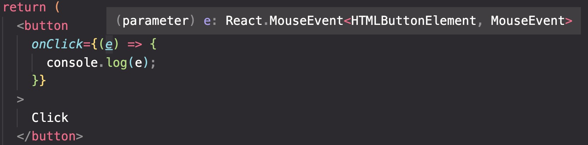

# React + TS

在 React 中，有一些特殊的类型，我们需要了解一下方便后续使用。

## CSS

我们经常会传入一个 style 对象，来修改组件的样式，我们不需要规定每一个期望样式，而只需要传入 style 的类型。

```TS
import React from "react";

type ButtonProps = {
  style: React.CSSProperties;
}
```

## 原生 Props

在我们的组件中会有很多的原生 props，(如 ClassName)，我们不可能全都写下来，也不知道哪些我们可能会传入。
而原生 props 的类型可以写入：

```TS title="ButtonExample.tsx"
import React from "react";

type ButtonNative = React.ComponentProps<"button">;
// 此时如果传入了如ClassName等原生prop，不需要写名也可以使用了。
export default function ButtonExample({ type, ...rest }: ButtonNative) {
  return (
    <button type={type} {...rest}>
      Click
    </button>
  )
}
```

这样不需要写剩下的了，所有`元素自带的 props `都会存在 type 中, 也不会报错。

```TS title="app.tsx"
import { ButtonExample } from "./ButtonExample.tsx";

// correct next line
<ButtonExample type="submit" autoFocus={true}></ButtonExample>

// error next line
<ButtonExample type="submit" price={6}></ButtonExample>  //price is not native prop
```

### 使用 ref 时

需要使用 ref 的时候要使用 ComponentPropsWithRef

```TS
import React from "react";

type ButtonNative = React.ComponentPropsWithRef<"button">;
```

## Children

一般的情况下，子元素类型为 `ReactNode` (React 节点)。可以放入 string，number，div 等。

```TS title="normal"
import React from "react";

type ButtonProps = {
  children: React.ReactNode;
};

export default function ButtonTest({ children }: ButtonProps) {
  return <button>{children}</button>;
}
```

如果想要特定的类型，比如一定要接收一个组件。那么类型是 `JSX.Element`。

```TS title="Component"
type ButtonProps = {
  children: JSX.Element;
};

export default function ButtonTest({ children }: ButtonProps) {
  return <button>{children}</button>;
}
```

## Function

React 函数根据返回值来写名 Type。

```TS title="Component"
// No return value
type ButtonProps = {
  onClick: () => void;
};

export default function ButtonTest({ onClick }: ButtonProps) {
  return <button onClick={onClick}>Click</button>;
}
```

```TS title="App.tsx"
import { ButtonTest } from "./ButtonTest.tsx";

const handleClick = (param:string) => {
  return 666
}
// error next line
<ButtonTest onClick={handleClick}></ButtonTest>  // there is a return value
```

如果想要 params，则这样书写：

```TS title="Component"
// If with return value
type ButtonPropsWithParams = {
  onClick: (param: string) => number;
};
```

## EventHandler

在 TS 中的 event 事件，如 onClick/onChange 中的 event 事件，我们不知道他的类型怎么办？

可以先放入`内联`函数中，当我们使用 e => 的时候，hover 上去就可以看到类型了。



如果写在外部的话是没有提醒的，我们需要复制下来这个复杂的类型.

```TS title="EventHandler"
import React from "react";

type ButtonProps = {
  onClick: (e: React.MouseEvent<HTMLButtonElement, MouseEvent>) => void;
};

export default function ButtonTest({ onClick }: ButtonProps) {
  const handler = (e: React.MouseEvent<HTMLButtonElement, MouseEvent>) => {
    console.log(e);
  };
  return <button onClick={onClick}>Click</button>;
}
```

## Record

在 TypeScript 中，Record  类型是一个泛型类型，用于表示 **具有相同类型的属性的对象**。

`Record` 类型需要两个类型参数，第一个参数指定对象的`Key`，第二个参数指定对象的`Value`。

```TS title="ButtonTest.tsx"
type ButtonProps = {
  borderRadius: Record<string, number>;
};

export default function ButtonTest({ borderRadius }: ButtonProps) {
  console.log(borderRadius);
  return <button>Click</button>;
}
```

此时也不需要写入每一个传入的值，他只需要满足 `String : Number` 的结构就不会报错。

```TS title="App.tsx"
import { ButtonTest } from "./ButtonTest.tsx";

<ButtonTest borderRadius={{
  // correct-start
  topLeft: 5,
  topRight: 5,
  bottomLeft: 5,
  bottomRight: 5,
// correct-end
}}
></ButtonTest>
```

## Default Values

如果组件只有 default value 的话，不需要声明该 prop 的类型。

```TS title="ButtonTest.tsx"
// correct-start
export default function ButtonTest({ count = 0 }) {
  return <button> {count} </button>;
}
// correct-end
```

有 type 声明的话，还是需要写入 type 中。

```TS title="ButtonTest.tsx"
type ButtonProps = {
  // correct next line
  count: number;
  onClick: () => void;
};

export default function ButtonTest({ count = 0, onClick }: ButtonProps) {
  return <button onClick={onClick}>{count}</button>;
}
```
